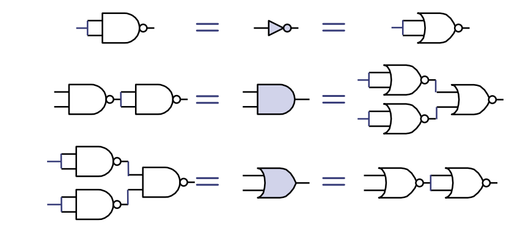

# L05-Combinational Circuits:From Boolean Algebra to Gates

---

MIT 6.004 2019 L05 Combinational Circuits: From Boolean Algebra to Gates，由教授Arvind讲述。

这次讲座的主题是组合电路，从布尔代数到门电路的转换。

## 主要内容

1. **课程结构回顾**：讲座开始时，教授回顾了课程的结构，提到第一模块已经完成，主要讲授了汇编语言编程，现在进入第二模块，即逻辑设计。

2. **逻辑设计**：在接下来的八次讲座中，学生将学习逻辑设计的各个方面，特别强调使用Bluespec语言来表达逻辑设计，并进行实验。

3. **逻辑合成**：讲解了如何将高级逻辑描述转化为实际硬件门电路的过程，这一部分涉及到大量的技术细节和工具的使用。

4. **组合电路基础**：教授介绍了组合电路的基本概念，包括它们的输入和输出均为二进制的特性，以及它们是无状态的，即相同的输入总是产生相同的输出。

5. **基本逻辑门**：详细介绍了包括NOT门（非门）、AND门（与门）、OR门（或门）、NAND门（与非门）、NOR门（或非门）、XOR门（异或门）在内的基本逻辑门，以及它们的真值表和符号表示。

6. **布尔表达式与真值表**：讲解了如何从真值表得到布尔表达式，以及如何使用AND、OR和NOT门来构建这些表达式。

7. **通用门**：讨论了如何使用NAND和NOR门来表示任何布尔函数，显示了这些门的通用性。

8. **半加器与全加器**：讲解了二进制加法的硬件实现，包括半加器和全加器的设计和功能。

9. **使用Bluespec语言**：演示了如何使用Bluespec System Verilog来描述和模拟电路，这是一个针对硬件设计的高级描述语言。

总结来说，这次讲座深入探讨了从布尔代数到门电路的转换，逻辑设计的各个方面，以及如何使用现代工具和语言来实现和模拟复杂的数字逻辑电路。教授强调了理解这些基本概念的重要性，并展示了将这些理论应用于实际硬件设计中的方法。

---

# 分页知识点

### 组合电路：从布尔代数到门电路

- **讲师**：Arvind，来自麻省理工学院的计算机科学与人工智能实验室。
- **日期**：2019年2月21日。

### MIT 6.004 2019年春季课程的大纲:

- **模块 1**：RISC-V汇编语言编程（4讲）。
- **模块 2**：数字逻辑设计（8讲），内容涵盖布尔代数、组合电路、时序电路、在Bluespec中表达逻辑设计、逻辑综合（包括将Bluespec设计转化为逻辑电路，以及将逻辑电路转化为标准的门电路库），以及并发问题。
- **模块 3**：RISC-V处理器（6+1讲）。
- **模块 4**：操作系统、输入/输出、虚拟内存（3讲）。
- **模块 5**：多核处理器（2讲）。

### 组合电路：

- 组合电路有二进制的输入和输出。
- 它代表一个纯函数（pure function），例如 `f: Bool × Bool × Bool → Bool × Bool`，表示这个函数接受三个布尔值作为输入，输出两个布尔值。
- 它没有记忆或状态，即给定相同的输入，它总是产生相同的输出。

### 三种简单的组合电路：

- **NOT（非）门**：输入为0时输出1，输入为1时输出0。门电路符号为一个三角形带有一个小圆圈，布尔表达式表示为 `s = ~a`。
- **AND（与）门**：只有当所有输入都为1时输出才为1，否则输出为0。门电路符号为一个扁平的D形，布尔表达式表示为 `s = a · b`。
- **OR（或）门**：只要任一输入为1，输出就为1。门电路符号为一个曲线形状，布尔表达式表示为 `s = a + b`。

图片中的内容继续讨论了组合电路中的一些著名逻辑门，以及如何用真值表来定义组合电路的功能。内容的中文翻译和详细解释如下：

### 其他著名的门电路：

- **NAND门**：当两个输入都为1时，输出为0；其余情况输出为1。NAND门的功能可以用NOT门、AND门和OR门来表达，其布尔表达式为 `s = ~(a·b)`。
- **NOR门**：只有当两个输入都为0时，输出为1；其余情况输出为0。其布尔表达式为 `s = ~(a+b)`。

### 异或门（XOR）：另一个著名的门电路：

- XOR门根据输入不同产生不同的输出：当一个输入为1，另一个为0时，输出为1。因此，XOR门在两个输入不同时产生1。其布尔表达式为 `s = a ⊕ b`，可以使用NOT门、AND门和OR门来表达。

### 专有名词：

- 以下几个分类的词汇可以互换使用：
  - 组合电路（combinational circuits）
  - 布尔表达式（Boolean expressions）
  - 布尔电路（Boolean circuits）
  - 门（gate）、布尔运算符（Boolean operator）
- 在组合电路中，变量用于命名电路中的导线。

### 真值表

任何组合电路的功能都可以使用真值表来定义。真值表列出了输入的所有可能组合，并为每种输入组合指定了输出。

例如，电路 f 的输入为 a、b、c，输出为 s1 和 s2 的真值表如下所示：

```rust
a b c | s1 s2
-------------
0 0 0 |  1  0
0 0 1 |  0  0
0 1 0 |  0  0
0 1 1 |  0  1
1 0 0 |  1  1
1 0 1 |  1  0
1 1 0 |  0  1
1 1 1 |  0  0
```

对于 n 个输入和 m 个输出的函数，真值表的大小是 \( 2^n \) 个 m 位的行。然而，真值表不适合描述具有大量输入的函数，因为行数会随着输入数量的增加而呈指数增长。

### 从真值表到布尔表达式

每个真值表都对应一个布尔表达式：
- 对每个输出为1的行，只使用AND和NOT写一个乘积项。
- 最终的布尔表达式是所有这些乘积项的和。

对于上述真值表，s1 和 s2 的布尔表达式可以表示为：
- \\( s1 = (\neg a \cdot \neg b \cdot \neg c) + (a \cdot \neg b \cdot \neg c) + (a \cdot \neg b \cdot c) \\)
- \\( s2 = (\neg a \cdot b \cdot c) + (a \cdot \neg b \cdot \neg c) + (a \cdot b \cdot \neg c) \\)

这种表示方式称为乘积之和（SOP）表示。

这些公式的意义在于通过布尔代数的基本运算，我们可以从基本的真值表达到任何特定逻辑功能的表达，它是构建复杂电路设计的基石。通过这种方法，可以将抽象的逻辑设计转化为具体的电路设计。在实际电路设计中，特别是在硬件描述语言（HDL）中，SOP表示形式常用于自动合成电路，并作为优化逻辑的起点。

### 通用门集

一组逻辑门如果能够用来描述任何布尔函数，则称为通用的。以下是一些例子：
- {AND, OR, NOT}
- {NAND}
- {NOR}

证明：任何真值表都可以用乘积之和的形式表示。



#### 图解证明
图中展示了如何仅使用NAND或NOR门来构建与门、或门和非门的等效电路，证明了NAND和NOR门作为通用门的能力。

### 二进制加法

二进制加法的执行过程与十进制加法类似。

#### 十进制例子
14加7等于21，在二进制下，1110(即十进制下的14)加111(即十进制下的7)等于10101(即十进制下的21)。

让我们构建一个硬件加法器。

### 半加器

半加器（HA）可以将两个一位数相加，并产生一个和位和一个进位位。

#### 布尔方程式
- 和位 \( s \) 是输入 \( a \) 和 \( b \) 的异或：\\( s = \neg a \cdot b + a \cdot \neg b = a \oplus b \\)
- 进位位 \( c \) 是输入 \( a \) 和 \( b \) 的与：\\( c = a \cdot b \\)

在这段内容中，半加器是基础数字电路设计的初步，通常作为更复杂加法器（如全加器）的基本组件。该布尔方程式表明，半加器可以通过简单的逻辑门操作来实现，其中和位是由两个输入异或（互斥或）得出的结果，而进位位则是由两个输入相与得出的结果。这种设计允许我们在构建数字系统时进行模块化设计，使得可以用相同的半加器模块组合出不同的、更复杂的数字电路。

### 组合逻辑用于加法器

全加器（FA）将两个一位数和一个进位位相加，并产生一个和位和一个进位位；可以用两个半加器（HA）来构建。
- 为了进行二进制加法，可以级联多个全加器。

### 描述一个32位加法器的替代方法

- 一个真值表有2^64行和33列（sum(32) + carry(1)）。
- 有32组布尔方程组，每组描述一个全加器（FA）。
- 一些表示法用于描述递归：
  - \\(  t_k = a_k \oplus b_k \\)
  - \\(  s_k = t_k \oplus c_k \\)
  - \\(  c_{k+1} = a_k \cdot b_k + c_k \cdot t_k \\)  ， 0 ≤ k ≤ 31
- 电路图绘制起来繁琐且不直观。

使用名为Bluespec System Verilog（BSV）的编程语言来表达所有电路，因为它更适合计算机模拟电路的行为，即确定给定输入的输出。

在这部分内容中，全加器是通过两个半加器的输出——一个是直接的和位输出，另一个是两个输入与运算的结果，作为进位输出——来构建的。通过级联全加器，我们可以实现任意长度的二进制加法。级联全加器是在数字电路设计中常用的技术，允许一位一位地累加并传递进位。

在描述32位加法器时，真值表方法会变得不可行，因为这会涉及到巨量的数据行和列。这就需要一种更高效的方法来描述加法器的行为，而且能够让计算机轻松处理和模拟。在硬件设计领域，通常会使用硬件描述语言（HDL），如Bluespec System Verilog（BSV），它允许设计师以高级语言的形式来描述硬件逻辑，而后自动转换成电路设计。

上述的递归关系公式是布尔代数中的基本运算，反映了二进制加法中的进位传递逻辑。在这里，⊕ 表示异或运算，是不带进位的加法，而 ⋅ 表示与运算，用于计算进位。Bluespec System Verilog 允许开发者用几乎是编程的形式来设计这样的逻辑，使得可以自动生成和验证硬件电路设计

### 半加器在Bluespec中的表示

- 展示了在Bluespec中半加器的函数表示和布尔方程式。
- 布尔方程式如下：
  - \\( s = \neg a \cdot b + a \cdot \neg b = a \oplus b\\)
  - \\( c = a \cdot b\\)
- 表示中提到了异或运算 `^` 和与运算 `&`。
- 但代码注明“不太正确 - 需要类型注解”。

### 半加器修正后的表示

- 补充了类型声明的Bluespec函数定义：
```rust
function Bit#(2) ha(Bit#(1) a, Bit#(1) b);
Bit#(1) s; // 声明变量s为一位宽的比特类型
Bit#(1) c; // 声明变量c为一位宽的比特类型
Bit#(2) result; // 声明变量result为两位宽的比特向量
s = a ^ b; // 定义变量s为输入a和b的异或结果，对应 s = a ⊕ b
c = a & b; // 定义变量c为输入a和b的与结果，对应 c = a · b
result[0] = s; // 将s赋值给result的第0位，表示 result 的第0位是和位
result[1] = c; // 将c赋值给result的第1位，表示 result 的第1位是进位位
return result; // 返回result变量
endfunction
```
- 这个修正版本的函数声明确保了在Bluespec语言中，类型的严格性与硬件设计的准确性密切相关，以确保生成的硬件电路可以正常工作。

这段代码的每一行都是函数定义的一部分，它详细描述了半加器在硬件描述语言Bluespec中的实现。以下是代码的具体解释：

1. `function Bit#(2) ha(Bit#(1) a, Bit#(1) b);`
   - 这行代码声明了一个名为`ha`的函数，它返回一个二位宽的比特向量`Bit#(2)`。这个函数接受两个一位宽的比特参数`Bit#(1)`，分别是`a`和`b`。
2. `Bit#(1) s;`
   - 这行声明了一个名为`s`的变量，它是一个一位宽的比特类型，用于存储半加器的和结果。
3. `Bit#(1) c;`
   - 这行声明了一个名为`c`的变量，它也是一个一位宽的比特类型，用于存储半加器的进位结果。
4. `Bit#(2) result;`
   - 这行声明了一个名为`result`的二位宽的比特向量，它用于存储函数的最终输出。
5. `s = a ^ b;`
   - 这行代码使用异或运算符`^`来计算`a`和`b`的和，并将结果赋值给`s`。在布尔代数中，异或运算符表示两个输入不同则输出为1，相同则为0。
6. `c = a & b;`
   - 这行代码使用与运算符`&`来计算`a`和`b`的进位，并将结果赋值给`c`。在布尔代数中，与运算符表示只有当两个输入都为1时，输出才为1。
7. `result[0] = s;`
   - 这行代码将`s`赋值给`result`向量的第0位。
8. `result[1] = c;`
   - 这行代码将`c`赋值给`result`向量的第1位。
9. `return result;`
   - 这行代码返回`result`变量，它包含了半加器的计算结果，其中包括和位和进位位。
10. `endfunction`
    - 这行代码标志着函数定义的结束。

在Bluespec中，类型注释非常重要，因为它们定义了电路中每个信号的宽度，确保在实际硬件实现时能正确地处理信号。函数`ha`在这里描述的是一个半加器，半加器是数字电路设计中的基础元件，通常用作构建更复杂电路如全加器的基础模块。

### 更便捷的语法

```rust
function Bit#(2) ha(Bit#(1) a, Bit#(1) b);
Bit#(1) s = a ^ b; // 变量类型可以在声明变量的同时定义
Bit#(1) c = a & b; // {…} 可用于定义一个位向量
return {c, s}; // 使用 {c, s} 的表示法避免了命名中间结果的需求
endfunction
```

- 这个函数`ha`返回一个两位宽的位向量，其中包含了和位（s）和进位（c）。
- `{c, s}`的位宽是2位。
- 使用 `{c, s}` 这种表示法可以避免对中间结果进行命名，使得代码更加简洁和易于理解。

### 全加器使用半加器

#### 全加器fa

全加器可以通过两个半加器来构建，并且可以通过级联多个全加器来进行二进制加法运算。

```rust
function Bit#(2) fa(Bit#(1) a, Bit#(1) b, Bit#(1) c_in);
Bit#(2) ab = ha(a, b); // 使用半加器计算a和b的和
Bit#(2) abc = ha(ab[0], c_in); // 使用半加器计算上一步的结果和进位位的和
Bit#(1) c_out = ab[1] | abc[1]; // 计算最终的进位位
return {c_out, abc[0]}; // 返回最终的和位和进位位
endfunction
```

- 这个函数`fa`返回一个两位宽的位向量，其中包含了和位（`abc[0]`）和进位（`c_out`）。
- 半加器在这里被用作黑盒，`fa`的代码实际上就是一个连接图。
- 这种设计模式展示了在硬件描述语言中，函数可以被视作黑盒子来使用，通过连接它们的输出输入来构建更复杂的功能模块。

### 两位的级联进位加法器

二进制级联进位加法器通过级联全加器构建。

```rust
function Bit#(3) add2(Bit#(2) x, Bit#(2) y);
Bit#(2) s = 2'b00; // s是一个两位宽的位向量，初始化为0
Bit#(3) c = 3'b000; // c是一个三位宽的位向量，初始化为0
Bit#(2) cs0 = fa(x[0], y[0], c[0]); // 使用全加器计算最低位
s[0] = cs0[0]; // 更新和位的最低位
c[1] = cs0[1]; // 更新进位位
Bit#(2) cs1 = fa(x[1], y[1], c[1]); // 使用全加器计算第二位
s[1] = cs1[0]; // 更新和位的第二位
c[2] = cs1[1]; // 更新进位位
return {c[2], s}; // 返回总和和进位位
endfunction
```

- 这个函数`add2`返回一个三位宽的位向量，其中包含了两个输入`x`和`y`的和，以及产生的进位。
- 全加器`fa`作为黑盒子被用于计算每一位的和与进位。
- 这段代码展示了二进制加法中级联全加器的基本概念，即如何一步一步地处理每个比特位，同时管理和传递进位。

在上述Bluespec代码中，我们看到了如何利用更简洁的语法来减少代码的冗长性，以及如何将基础的数字逻辑组件如半加器和全加器组合成完成更高级任务的电路。

## 选择器和多路复用器

### 选择一个线：x[i]
假设x是4位宽。

- **常数选择器**：例如，x[2]
  - 这里x[2]表示直接选择x中的第二位。在这个上下文中，没有额外的硬件被使用；x[2]仅仅是一根导线的名字。

- **动态选择器**：x[i]
  - 与常数选择器不同，动态选择器使用索引i来选择x中的位。这需要一个4路多路复用器，根据i的值动态地选择x[0]、x[1]、x[2]或x[3]。

### 2路多路复用器

- 一个多路复用器是一个简单的条件表达式。

##### Bluespec
```bluespec
(p) ? b : a;
```
在Bluespec语言中，`(p) ? b : a;`表示如果p为真，则选择b；否则选择a。布尔值真在这里被视为1，假被视为0。

##### Python
```python
return b if p else a
```
在Python语言中，`return b if p else a`与Bluespec中的表达方式类似，也是根据条件p来选择返回b或a。

- **门级实现**
  - 如果a和b是n位宽，则这个结构将在n次中复制；p是所有复制结构的相同输入。

### 4路多路复用器

四路多路复用器可以基于两个选择信号从四个输入中选择一个。

#### 语法：
使用Bluespec语言的`case`语句来实现多路复用器的行为：
```rust
case ({s1, s0})
  2'b00: a;
  2'b01: b;
  2'b10: c;
  2'b11: d;
endcase
```
在这里，`{s1, s0}`是一个2位的选择信号，`2'b00`，`2'b01`，`2'b10`和`2'b11`代表不同的选择组合。`a`，`b`，`c`和`d`是四个输入信号。这种语法表明，根据选择信号的值，多路复用器会选择相应的输入信号进行输出。

#### Python 代码示例：
```python
def mux(a, b, c, d, s):
  if s == 0:
    return a
  elif s == 1:
    return b
  elif s == 2:
    return c
  else:
    return d
```
这段Python代码说明了相同逻辑的实现方式：根据选择信号`s`的值（0, 1, 2, 或 3），函数将返回相应的输入信号（`a`，`b`，`c`，或 `d`）。

注意，`{s1=0} & {s0=1}`，即选择信号为`01`时，多路复用器输出`b`，这与`case`语句中的`2'b01: b;`相同。

在n路多路复用器中，通常可以通过组合多个两路多路复用器来实现。例如，一个4路多路复用器可以通过组合三个两路多路复用器来构造。

### 下一讲

- 更多简单的组合电路
- 逻辑综合和电路优化

### 课后作业

1. 提供一个全加器的真值表。
2. 为全加器的每个输出指定一个乘积之和（SOP）表示形式。


多路复用器在数字逻辑中扮演着重要角色，它允许在给定的多个输入信号中基于控制信号选择一个信号。这是逻辑设计中基本的决策组件，广泛用于CPU设计中的寄存器文件、算术逻辑单元(ALU)、和数据路径等场景。在硬件描述语言中，多路复用器通常用条件表达式来描述，这体现了硬件设计中逻辑与编程之间的类似性。
