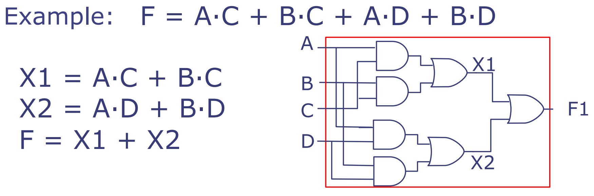
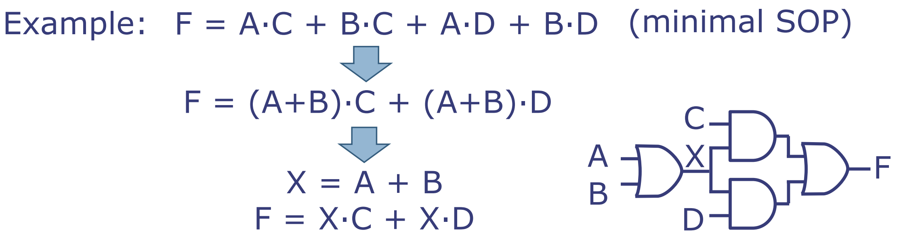
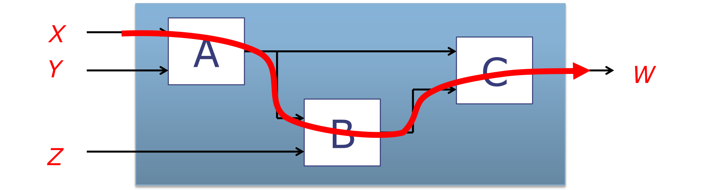
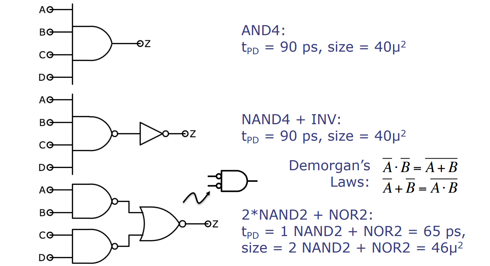
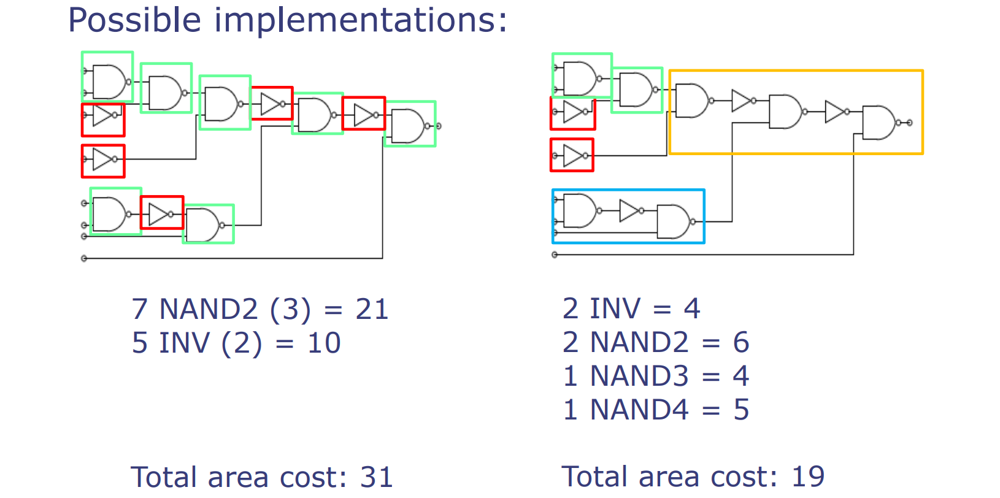

# L06-Barrel Shifter, Boolean Optimizations, and Logic Synthesis

---

MIT 6.004 2019 L06 Barrel Shifter, Boolean Optimizations, and Logic Synthesis，由Silvina Hanono Wachman讲述。

这次讲座的主题为：组合电路和多路复用器的硬件实现。

## 主要内容

1. **组合电路硬件实现**：
   - 继续上次讨论的内容，深入了解不同组合电路的硬件实现。
   - 介绍了半加器、全加器以及不同尺寸的多路复用器的实现细节。

2. **移位器的硬件实现**：
   - 讨论了如何在硬件中实现逻辑和算术移位操作。
   - 介绍了实现可变大小移位（0到31位）的硬件设计，以及如何通过多步移位来实现。

3. **布尔优化**：
   - 探讨了如何使用真值表和"不关心"的值来简化电路表示。
   - 介绍了通过布尔优化减少和简化门数量的方法。

4. **逻辑合成**：
   - 强调了将高级描述的组合电路转换为硬件电路的重要性，以及这一过程中需要考虑的参数，如门延迟、面积和功耗。
   - 讲述了如何使用逻辑合成工具根据特定的门库和优化目标自动化电路设计。

5. **课后作业**：
   - 要求提供一个全加器的真值表。
   - 要求为全加器的每个输出指定乘积之和（SOP）表示形式。

讲座最后，教授指出在设计硬件电路时需要理解如加法器和多路复用器等基本组件的功能。通过布尔优化和逻辑合成，设计者能够根据面积、速度和功耗等约束条件制定最优的硬件实现方案。

---

# 分页知识点

## Shift operators 移位运算符

### 逻辑右移两位

逻辑右移是一种简单的硬件操作，其中输入的线路会被重新连接到输出的不同位置上。例如，四位数`a b c d`向右逻辑移动两位，结果是`0 0 a b`，而最高的两位（`c`和`d`）被移出。这种固定大小的移位操作在硬件中很容易实现，并且算术移位与之类似。

- 示例1：`1001`向右逻辑移动两位，变为`0010`。
- 示例2：使用两位补码`1100`表示的`-4`，如果进行算术右移两位（保留符号位），结果是`1110`，表示的是`-2`。

### 逻辑右移`n`位

如果需要构建一个可以将数值`x`进行0至31位任意数目的右移的移位器，一种方法是连接32个不同的移位器，并通过一个多路选择器（MUX）来选择输出。

- 例如，要实现从0到31的任意位数移动的移位器，可以用一个大型多路选择器连接32个固定移位器。

但是这种结构需要很多二路一位MUX来实现，具体数量是`n*(n-1)`。考虑到这样的电路可能非常大，设计者可能会寻求更优的解决方案。

### 通过`n`逻辑右移位

逻辑右移可以通过多个步骤实现，每个步骤移动固定长度，比如1、2、4等双倍增加的位数。

- 例如，可以通过先右移4位，然后再移动1位来实现向右移动5位。
- 对于32位数字，一个5位的`n`可以指定所有需要的移位，比如`n`的二进制表示为`00101`，表示我们需要右移1位和4位。
- 如果`n`的最低位（最不重要的位）是1，则我们需要向右移动`2^0`位。

这是一个权衡延迟和尺寸的例子，其中通过增加多个步骤来减小电路的整体大小。

在硬件设计中，这些移位运算是实现快速算术计算的基础，特别是在处理乘法和除法时，移位操作可以提供有效的计算捷径。例如，在处理器设计中，对寄存器内容的移位操作可以快速实现乘以或除以2的幂等计算。设计者需要在硬件资源消耗（如面积和电力）与计算速度之间进行权衡，找到最适合其应用的解决方案。

### 条件操作：移位与不移位

我们需要一个多路选择器（MUX）来选择适当的线路：如果`s`为1，MUX将选择左侧的线路（移位）；否则它将选择右侧的线路（不移位）。

- 表达式`（s==1）? {2'b0,a,b}:{a,b,c,d}`的意思是，如果s为1，输出为`00ab`，表示执行移位操作；如果s为0，输出为`abcd`，表示不执行移位操作。

### 逻辑右移电路

定义`log n`个不同大小的移位器，比如1、2、4等。
定义`log n`个多路选择器来执行特定大小的移位操作。
假设`s = {s1,s0}`是一个两位的数字。移位电路通过`s`来移动数字可以通过两个条件表达式表示，其中第二个表达式使用第一个的输出。

- 示例中的代码展示了如何利用Bluespec语言进行逻辑右移操作的描述。

```haskell
Bit#(4) input = {a,b,c,d}

Bit#(4) tmp = (s1==1)? {2'b0,a,b}:input;

Bit#(4) output = (s0==1)? {1'b0, tmp[3], tmp[2], tmp[1]}:tmp;
```

- `{2'b0,a,b}`表示将输入`a`和`b`移位了两位，最高的两位补0。
- `{1'b0,tmp[3],tmp[2],tmp[1]}`则表示将临时变量`tmp`的最高三位向右移动一位，并在最高位补0。

在硬件设计中，条件移位操作允许根据输入信号`s`的值决定是否执行移位，这是数据处理和信号处理中的一种常见技术。在处理器中，这种操作通常是用硬件逻辑电路实现的，可以非常快速地进行。逻辑右移电路可以根据需要进行灵活的位移操作，对于实现各种算术运算、数据加工和信号调制非常重要。通过合理设计，这种电路不仅能够确保正确性，还能优化执行速度和硬件资源使用。

## Boolean Optimizations 布尔优化

### 等价性和正规形式

- 每个函数都可以用真值表来描述。
- 每个真值表都对应一个布尔表达式。

例如，以下真值表

```haskell
| C | B | A | Y |
|---|---|---|---|
| 0 | 0 | 0 | 0 |
| 0 | 0 | 1 | 1 |
| 0 | 1 | 0 | 0 |
| 0 | 1 | 1 | 1 |
| 1 | 0 | 0 | 0 |
| 1 | 0 | 1 | 0 |
| 1 | 1 | 0 | 1 |
| 1 | 1 | 1 | 1 |
```

的积之和（SOP）形式表示为：

\\[Y = \overline{C}\overline{B}A + \overline{C}BA + C B \overline{A} + CBA \\]

这种表示称为函数的正规形式（normal form），它是唯一的，但可能存在更简单的表达式。

### 使用布尔代数简化布尔表达式

可以通过以下布尔代数的性质来操纵布尔表达式：

- 交换律：\\( a \cdot b = b \cdot a \\)，\\( a + b = b + a \\)
- 结合律：\\( a \cdot (b \cdot c) = (a \cdot b) \cdot c \\)，\\( a + (b + c) = (a + b) + c \\)
- 分配律：\\( a \cdot (b + c) = a \cdot b + a \cdot c \\)，\\( a + b \cdot c = (a + b) \cdot (a + c) \\)
- 补码：\\( a \cdot \overline{a} = 0 \\)，\\( a + \overline{a} = 1 \\)
- 吸收律：\\( a \cdot (a + b) = a \\)，\\( a + a \cdot b = a \\)
- 约简：\\( a \cdot b + a \cdot \overline{b} = a \\)，\\( (a + b) \cdot (a + \overline{b}) = a \\)
- DeMorgan 定律：\\( \overline{a \cdot b} = \overline{a} + \overline{b} \\)，\\( \overline{a + b} = \overline{a} \cdot \overline{b} \\)

利用这些性质，可以从正规形式中去除我们不关心的变量，或者当我们知道一个输入为零时，可以消除那些项。例如，如果我们有一个乘积项 \\( a \cdot \overline{a} \\)，我们知道这不可能为真，因此可以用零替换该乘积项，并从表达式中移除。同样地，如果我们有 \\( a + \overline{a} \\)，我们知道这等同于一，因此是优化的又一个机会。通过这种方式，我们可以将复杂的布尔表达式简化为需要更少门数量和可能更小门的简单表达式。这对于减小硬件成本和提高计算效率至关重要。在设计复杂的逻辑电路时，这种优化是一个必不可少的步骤，它不仅可以减少所需的硬件资源，还能改善电路的性能。

### SOPs的布尔简化

- 最小积之和（SOPs）是一种积之和表达式，它拥有可能最少的AND和OR运算符数量。这种表达式对硬件资源的需求更小，因为它可以使用更少且更小的逻辑门来实现。

例如前面的原始表达式：

 \\[Y = \overline{C}\overline{B}A + C B \overline{A} + CBA + \overline{C}BA\\]

它包含了四个项。通过观察，我们可以合并中间两项和两边两项，使用的是布尔代数中的吸收律：

- 合并 \\(C B \overline{A}\\) 和 \\(CBA\\) 可以得到 \\(CB\\)，因为 \\(CBA + CB\overline{A} = CB(A + \overline{A}) = CB\\)。
- 合并 \\(\overline{C}\overline{B}A\\) 和 \\(\overline{C}BA\\) 可以得到 \\(\overline{C}A\\)，因为 \\(\overline{C}BA + \overline{C}\overline{B}A = \overline{C}A(B + \overline{B}) = \overline{C}A\\)。

因此，简化后的表达式为：

\\[ Y = \overline{C}A + CB \\]

- 最小SOPs可以用更少更小的逻辑门来实现。
- 不同于正规形式，它不是唯一的（一个函数可能有多个最小SOPs）。

在计算机硬件设计中，这种布尔表达式的简化对于优化逻辑电路至关重要。通过减少所需的逻辑门数量，可以节省硬件成本，降低能耗，并可能提升电路的运算速度。简化也可以让电路设计更加简洁，更容易理解和维护。此外，简化过程还有助于减少潜在的错误，因为复杂的逻辑表达式更容易出错。在设计高效能的计算机硬件时，工程师会积极寻找能够简化电路设计的各种方法。

### 使用“不关心”条件的真值表

使用“不关心”(don't care)条件来简化真值表。在布尔逻辑中，“不关心”的条件表示输入的某些组合不影响输出，这允许我们在设计电路时忽略它们。这通常用于简化布尔表达式，优化电路设计。

- 表格中的“X”或“-”表示不关心的条件。这意味着无论该位的值是0还是1，都不会影响输出结果。
- 通过合并具有相同输出值且只在不关心位上有差异的行，可以减少生成布尔表达式时需要的项数。

例如原始的真值表如下所示：

```haskell
|行号| C B A | Y
---------------
| 1 | 0 0 0 | 0
| 2 | 0 0 1 | 1
| 3 | 0 1 0 | 0
| 4 | 0 1 1 | 1
| 5 | 1 0 0 | 0
| 6 | 1 0 1 | 0
| 7 | 1 1 0 | 1
| 8 | 1 1 1 | 1
```

在简化的真值表中，我们用 "X" 或 "-" 来表示“不关心”的条件：

```haskell
|行号| C B A | Y
---------------
| 1 | 0 X 0 | 0
| 2 | 0 X 1 | 1
| 3 | 1 0 X | 0
| 4 | 1 1 X | 1
| 5 | X 0 0 | 0
| 6 | X 1 1 | 1
```

对此进行分析：

- 原始行 1和3，无论B的值是什么，如果 \\(C=A=0\\)，则Y总是0。因此，可以合并成简化行1。

- 原始行 2和4，当A=1时，无论B的值是什么，如果C=0，则Y总是1。因此，`0 X 1`的行可以合并成一个项，即简化行2， \\(\overline{C}A\\)。这也包括了简化行1的情况。
- 原始行 5和6，无论A的值是什么，如果C=1，B=0，则Y总是0。因此，可以合并成简化行3。
- 原始行 7和8，当C=1时，无论A的值是什么，如果B=1，则Y总是1。因此，`1 1 X`的行可以合并成一个项，即简化行4， \\(CB\\)。这也包括了简化行3的情况。

到了这一步，我们发现已经能覆盖所有Y=1的情况，因此这个表达式已经足够：

\\[ Y = \overline{C}A + CB \\]

但是幻灯片中出现了额外的 `X 0 0` 和 `X 1 1` 的情况，似乎指向了一个 \\(BA\\) 项。通常，不需要添加这样的项，除非我们有其他的目的，比如想要在实现电路时有更好的性能（例如，减少延迟或简化硬件实现）。在没有这样的需求下，\\(BA\\) 项是不必要的，因为 \\(CB\\) 和 \\(\overline{C}A\\) 已经完整地覆盖了所有Y=1的情况。

在实际的逻辑电路设计中，可能会有其他考虑，比如确保电路的对称性或制造工艺的要求，这些都可能导致在简化的真值表中添加额外的项。在没有特定背景知识的情况下，我们只能根据布尔逻辑的简化规则进行分析。

### 多级电路

如果我们只能使用双输入的AND和OR门，则乘积之和（Sum-of-Product, SOP）电路不总能仅使用两级逻辑来实现。例如：



函数F可以表达为A与C的AND（A·C），B与C的AND（B·C），A与D的AND（A·D），以及B与D的AND（B·D）的OR组合。即：

\\[ F = A·C + B·C + A·D + B·D \\]

为了适应仅有双输入门的限制，我们可以将F分解为两个中间变量X1和X2：

\\[ X1 = A·C + B·C \\]
\\[ X2 = A·D + B·D \\]

然后F是X1和X2的OR结果：

\\[ F = X1 + X2 \\]

在快速的微处理器中，通常会使用8级逻辑电路，而较慢的处理器可能会使用14到18级的逻辑电路。

这种多级逻辑设计允许设计者创建复杂的电路，即使在受限于门输入数量的情况下。在这个例子中，为了实现函数F，我们需要组合多个逻辑门而不是使用单个门，这可能会导致电路延迟的增加，但允许我们在受限硬件中实现复杂功能。快速处理器使用更多级别的逻辑，以便优化它们的性能，尽管这可能会导致每个操作的完成需要更多时间。而慢速处理器使用更多级别的逻辑是因为它们可能在设计时考虑了更多的节能和成本效益因素。在微处理器设计中，逻辑级别的数量和电路的速度、能效之间需要权衡。

### 公共子表达式优化（CSE）

我们常常可以通过提取公共子表达式来减少逻辑门的数量。

例如：函数F可以表示为A与C的AND操作（A·C），B与C的AND操作（B·C），A与D的AND操作（A·D）以及B与D的AND操作（B·D）的OR组合，这是最小的乘积之和形式（minimal SOP）。

\\[ F = A·C + B·C + A·D + B·D \\]

通过提取公共项A+B，F可以重写为：

\\[ F = (A+B)·C + (A+B)·D \\]

然后通过引入一个新的中间变量X代表A+B，F可进一步简化为：

\\[ X = A + B \\]
\\[ F = X·C + X·D \\]



CSE优化可能会增加逻辑级别的数量。到目前为止，我们合成的电路总是看起来像是一个树结构，但是CSE优化的引入可以将树转换为一个有向无环图（DAG）。

多级简化没有明确定义的最优解，这意味着在寻求逻辑电路简化时，可能会有多种方法和结果，取决于优化的目标是减少门数量、减少逻辑级别，还是其他因素。这种优化可以提高电路的效率，但可能也会增加电路的复杂性。在逻辑电路设计中，找到最优的设计通常涉及到多方面的权衡，包括计算速度、硬件成本、能耗和物理尺寸等。

## Logic Synthesis 逻辑综合

### 组合电路属性

- 除了它们的功能性，组合电路还具有两个重要的物理属性：面积（area）和传播延迟（\\(t_{pd}\\)），即输出稳定化所需的时间。
- 这两个属性都是基于构建电路所用门的特性。
- 大部分电路都是基于特定CMOS技术实现的标准单元库构建的。

在设计组合电路时，功能性不是唯一的考量。电路的物理属性，例如占用的面积和信号在电路中传播所需的时间（即传播延迟），同样非常重要。面积直接关系到芯片的成本和制造复杂性，而传播延迟则影响电路的速度和响应时间。

### 计算面积和传播延迟



- A、B和C是组合电路。
- 输入为X、Y和Z，经过组合电路，输出为W。
- 功能描述：
  - \\( W = f_{C}(f_{A}(X, Y), f_{B}(f_{A}(X, Y), Z)) \\)
  - 这个表达式描述了输出W是如何从输入X、Y、Z和内部组合电路A、B、C得到的。它说明电路C的输出W是由电路A处理输入X和Y的结果，以及电路B处理电路A的输出和输入Z的结果，这两个结果共同决定的。
- 传播延迟：
  - \\( t_{pd} = t_{pd,A} + t_{pd,B} + t_{pd,C} \\)
  - 这个公式计算了电路的总传播延迟，它是电路A、B和C各自传播延迟的总和。传播延迟是指从输入信号稳定到输出信号稳定所需的时间。这里假设信号从电路A流向B，再流向C，因此这三个电路的延迟是连续的，它们的延迟会累加。
- 面积：
  - \\( \text{area} = \text{area}_A + \text{area}_B + \text{area}_C \\)，忽略了连线的面积。
  - 这个公式计算了整个组合电路的总面积，它是构成电路A、B和C各自面积的总和。面积是指电路所占用的物理空间大小，与电路的复杂度和成本直接相关。这里忽略了电路之间连线的面积，这在小电路中是常见的做法，但在更大或更复杂的设计中，连线可能占据显著的面积并影响总面积。

这些物理属性来自于构建电路的基本组件——逻辑门（比如AND门、OR门等）的性能。例如，较小的门可能会占用更少的面积，但可能导致更长的传播延迟。设计师通常需要在这些不同的性能指标之间权衡，以优化整个电路的性能和成本。

在计算一个由多个组合电路构成的复杂电路的面积和传播延迟时，我们需要考虑每个子电路的对应属性。通常，电路的总传播延迟是沿最长路径的延迟之和，而总面积是各个子电路面积的总和（忽略连线的面积）。在实践中，设计工具会考虑这些参数来帮助设计师选择合适的门，以达到设计目标。

### 标准单元库

标准单元库是一系列集成电路门的集合，这些门具有特定的物理特性，例如延迟和面积。以下是一些常见的门和它们的特性：

| 门类型               | 延迟 (ps) | 面积 (μ²) |
| -------------------- | --------- | --------- |
| 反相器 (INV)         | 20        | 10        |
| 二输入与门 (AND2)    | 50        | 25        |
| 二输入与非门 (NAND2) | 30        | 15        |
| 二输入或门 (OR2)     | 55        | 26        |
| 二输入或非门 (NOR2)  | 35        | 16        |
| 四输入与门 (AND4)    | 90        | 40        |
| 四输入与非门 (NAND4) | 70        | 30        |
| 四输入或门 (OR4)     | 100       | 42        |
| 四输入或非门 (NOR4)  | 80        | 32        |

#### 观察结果

1. 在当前CMOS技术中，反向门（如反相器、与非门和或非门）通常比正向门（如与门和或门）更快且更小。
2. 随着输入数的增加，延迟和面积也会增加。这表示多输入的门（如四输入门）相比较于少输入的门（如二输入门），其延迟更长，面积更大。

电路设计师在设计电路时，会根据所需的功能、延迟和面积要求，以及电路的功耗限制，从标准单元库中选择合适的门来构建电路。在选择门时，需要综合考虑这些因素，以实现电路设计的最优化。例如，如果面积是一个关键限制因素，那么设计师可能会倾向于选择尺寸更小的门；如果性能是主要考虑，那么可能会选择延迟更低的门。在CMOS技术中，由于反向门具有更好的性能特点，因此在实际电路设计中它们被广泛使用。

### 设计权衡：延迟与尺寸



此图展示了在电路设计中考虑延迟和尺寸时可能面临的权衡。

- **四输入与门（AND4）**：延迟为90皮秒，面积为40微米平方。
- **四输入与非门加反相器（NAND4 + INV）**：延迟为90皮秒，面积为40微米平方。
- **使用德摩根定律将与门转换为与非门和反相器**
  - DeMorgan 定律：\\( \overline{a \cdot b} = \overline{a} + \overline{b} \\)，\\( \overline{a + b} = \overline{a} \cdot \overline{b} \\)

- **两个二输入与非门加一个二输入或非门（2*NAND2 + NOR2）**：延迟为65皮秒，面积为46微米平方。

#### 详细解释

1. **直接使用四输入与门**的方案最简单，但如果需要更小的延迟，可能不是最优的选择。
2. **NAND加反相器**的方案通过使用与非门和反相器（遵循德摩根定律）来实现与门的功能，具有与直接使用与门相同的延迟和尺寸。
3. **两个NAND加一个NOR**的方案利用了两个二输入与非门来分别处理输入的一部分，并使用二输入或非门来整合结果。通过这种方式，尽管增加了面积，但显著减少了延迟。这展示了设计者如何在构建逻辑电路时，在不同的物理特性之间进行权衡。

在现实世界的硬件设计中，选择使用哪种门结构常常取决于特定应用对延迟和尺寸的具体要求。例如，如果设计要求低延迟，即使面积较大，设计者也可能选择使用多个与非门和或非门组合的方案。这种设计的复杂性体现了现代集成电路设计中必须考虑的多个维度。

#### 三种逻辑门的配置方式和它们各自的真值表

为了解释这三种逻辑门的配置方式和它们各自的真值表，我们首先要明确四个输入的与门（AND4）直接计算所有输入的逻辑与。对于四输入的与非门加反相器（NAND4 + INV）和两个二输入与非门加一个二输入或非门（2*NAND2 + NOR2），它们都是以不同的方式实现相同的四输入与操作。

下面是三种配置方式的流程和它们的真值表：

1. **直接使用四输入与门（AND4）**：

   - 流程：所有输入直接通过一个四输入与门。

   - 真值表：

     ```haskell
     A B C D | AND4
     ---------------
     0 0 0 0 |  0
     0 0 0 1 |  0
     ...   ... | ...
     1 1 1 1 |  1
     ```

   - 所有可能的输入组合中，只有当所有输入都为1时，输出才为1。

2. **四输入与非门加反相器（NAND4 + INV）**：

   - 流程：首先输入通过与非门，然后输出经过反相器。

   - 真值表（先展示NAND4，然后INV）：

     ```haskell
     A B C D | NAND4 | INV
     ----------------------
     0 0 0 0 |   1   |  0
     0 0 0 1 |   1   |  0
     ...   ... | ... | ...
     1 1 1 1 |   0   |  1
     ```

   - NAND4产生与AND4相反的结果，反相器再将其反转，因此最终结果与AND4相同。

3. **两个二输入与非门加一个二输入或非门（2*NAND2 + NOR2）**：

   - 流程：两个NAND2分别处理输入对AB和CD，然后NOR2将这两个结果结合，再通过一个与非门实现逻辑与操作。

   - 真值表（展示两个NAND2，然后对两个NAND2的结果NOR2）：

     ```haskell
     A B | NAND2 | C D | NAND2 | NOR2 |
     ----------------------------------
     0 0 |   1   | 0 0 |   1   |  0   |
     0 0 |   1   | 0 1 |   1   |  0   |
     0 0 |   1   | 1 0 |   1   |  0   |
     0 0 |   1   | 1 1 |   0   |  0   |
     0 1 |   1   | 0 0 |   1   |  0   |
     0 1 |   1   | 0 1 |   1   |  0   |
     0 1 |   1   | 1 0 |   1   |  0   |
     0 1 |   1   | 1 1 |   0   |  0   |
     1 0 |   1   | 0 0 |   1   |  0   |
     1 0 |   1   | 0 1 |   1   |  0   |
     1 0 |   1   | 1 0 |   1   |  0   |
     1 0 |   1   | 1 1 |   0   |  0   |
     1 1 |   0   | 0 0 |   1   |  0   |
     1 1 |   0   | 0 1 |   1   |  0   |
     1 1 |   0   | 1 0 |   1   |  0   |
     1 1 |   0   | 1 1 |   0   |  1   |
     ```

   - 通过这种方法，当所有输入都为1时，最终的输出为1，与AND4一致。

### 例子：电路映射到标准单元库

图中的电路由若干个逻辑门组成，它们的物理特性，如面积，是以某个标准单元库中的元素为基准的。这个库给出了不同类型门的面积，例如，反相器面积为2，两输入与非门面积为3，两输入或非门面积为4，两输入或门面积为5。

在设计电路时，工程师会基于特定的目标进行优化。例如，可以是最小化面积，这意味着在满足电路功能需求的同时，尽可能使用面积小的逻辑门。在这个过程中，设计者可能会选择一些逻辑上等效，但在物理特性上差异显著的组件，以达到其优化目标。

例如，如果要最小化面积，我们可能会选择使用面积为3的两输入与非门，而不是面积为5的两输入或门，即使它们在逻辑功能上可以互换。然而，这样的决策必须考虑到电路的整体性能，因为选择较小面积的门可能会对电路的速度和功耗产生影响。

这个过程需要工程师深入理解门的物理特性和逻辑功能，以及它们如何影响电路的整体设计。



图中展示了一个电路映射到标准单元库的两种可能实现方式。

第一种实现使用了7个两输入与非门（NAND2），每个面积为3，以及5个反相器（INV），每个面积为2，总面积成本为31。在这种布局中，所有逻辑操作都是直接通过与非门和反相器实现的，没有利用更高输入数量的门。

第二种实现更为精巧，它使用了不同类型和不同输入数量的门：2个反相器，每个面积为2，2个两输入与非门，每个面积为3，一个三输入与非门（面积为4），以及一个四输入与非门（面积为5），总面积成本为19。这种布局利用了不同的逻辑门组合以降低总面积。

逻辑优化与合成工具是现代计算机硬件设计中至关重要的组成部分。以下是根据你提供的内容，对图中信息的翻译和解释：

### 逻辑优化

- 优化电路的合成是一个非常复杂的问题，涉及布尔简化、映射到拥有许多门的单元库，以及多维度的折衷（例如，最小化面积-延迟-功耗的乘积）。
- 手动完成除最小型电路之外的所有电路几乎是不可行的。
- 因此，硬件设计师使用硬件描述语言来编写电路，并利用合成工具来推导出优化的实现。

### 逻辑合成工具

- 在实际中，工具使用布尔简化和其他技术来合成满足特定面积、延迟和功耗目标的电路。工具的输入包括：
  - 高级电路规格说明（例如，布尔代数，Bluespec语言）
  - 标准单元库（包含一组门及其物理特性）
  - 优化目标（面积/延迟/功耗）
- 合成工具的输出是使用标准单元库门实现的优化电路。

这个过程体现了硬件设计中的逻辑优化如何依赖于自动化工具来处理复杂性和实现高效的硬件设计。设计者不再需要手动执行这些优化，而是依赖于先进的合成工具来优化设计，以满足不断增长的性能需求和复杂性管理。合成工具的高级功能包括能够处理复杂的设计参数，自动识别和实施优化策略，以及将设计映射到具有具体物理特性的标准单元库。这种自动化过程不仅加快了设计过程，还提高了设计的质量和效率。

### 课后作业

1. 为以下布尔（SOP）表达式找到一个最小的乘积和（SOP）表达式：
   \\[ \overline{A}BC + A\overline{B}C + A\overline{B}\overline{C} + ABC \\]

2. 使用幻灯片#18中的门 ([见#标准单元库](#标准单元库))，找到一个实现这个最小SOP的方法，以最小化面积。

### 下一讲

- Bluespec 中的复杂组合电路

---

## 附：基本的逻辑门

1. **NOT Gate (非门)**

   - 符号:\\(\overline{A}\\)或\\(A'\\)

   - 表达式: 如果输入是\\(A\\)，输出是\\(\overline{A}\\)。

   - ```haskell
     A | NOT A
     ---------
     0 |   1
     1 |   0
     ```

2. **AND Gate (与门)**

   - 符号:\\(A \cdot B\\)

   - 表达式: 如果输入是\\(A\\) 和\\(B\\)，输出是\\(A \cdot B\\)。

   - ```haskell
     A B | A AND B
     -----------
     0 0 |    0
     0 1 |    0
     1 0 |    0
     1 1 |    1
     ```

3. **OR Gate (或门)**

   - 符号:\\(A + B\\)

   - 表达式: 如果输入是\\(A\\) 和\\(B\\)，输出是\\(A + B\\)。

   - ```haskell
     A B | A OR B
     -----------
     0 0 |    0
     0 1 |    1
     1 0 |    1
     1 1 |    1
     ```

4. **NAND Gate (与非门)**

   - 符号:\\(\overline{A \cdot B}\\)

   - 表达式: 如果输入是\\(A\\) 和\\(B\\)，输出是\\(\overline{A \cdot B}\\)。

   - ```haskell
     A B | A NAND B
     -------------
     0 0 |    1
     0 1 |    1
     1 0 |    1
     1 1 |    0
     ```

5. **NOR Gate (或非门)**

   - 符号:\\(\overline{A + B}\\)

   - 表达式: 如果输入是\\(A\\) 和\\(B\\)，输出是\\(\overline{A + B}\\)。

   - ```haskell
     A B | A NOR B
     ------------
     0 0 |    1
     0 1 |    0
     1 0 |    0
     1 1 |    0
     ```

6. **XOR Gate (异或门)**

   - 符号:\\(A \oplus B\\)

   - 表达式: 如果输入是\\(A\\) 和\\(B\\)，输出是\\(A \oplus B\\)。这表示当\\(A\\) 和\\(B\\) 不相同时输出为真（1）。

   - ```haskell
     A B | A XOR B
     ------------
     0 0 |    0
     0 1 |    1
     1 0 |    1
     1 1 |    0
     ```

7. **XNOR Gate (同或门)**

   - 符号:\\(\overline{A \oplus B}\\) 或\\(A \equiv B\\)

   - 表达式: 如果输入是\\(A\\) 和\\(B\\)，输出是\\(\overline{A \oplus B}\\)。这表示当\\(A\\) 和\\(B\\) 相同时输出为真（1）。

   - ```haskell
     A B | A XNOR B
     -------------
     0 0 |    1
     0 1 |    0
     1 0 |    0
     1 1 |    1
     ```

## 附：使用布尔代数简化布尔表达式

- 交换律：\\( a \cdot b = b \cdot a \\)，\\( a + b = b + a \\)
- 结合律：\\( a \cdot (b \cdot c) = (a \cdot b) \cdot c \\)，\\( a + (b + c) = (a + b) + c \\)
- 分配律：\\( a \cdot (b + c) = a \cdot b + a \cdot c \\)，\\( a + b \cdot c = (a + b) \cdot (a + c) \\)
- 补码：\\( a \cdot \overline{a} = 0 \\)，\\( a + \overline{a} = 1 \\)
- 吸收律：\\( a \cdot (a + b) = a \\)，\\( a + a \cdot b = a \\)
- 约简：\\( a \cdot b + a \cdot \overline{b} = a \\)，\\( (a + b) \cdot (a + \overline{b}) = a \\)
- DeMorgan 定律：\\( \overline{a \cdot b} = \overline{a} + \overline{b} \\)，\\( \overline{a + b} = \overline{a} \cdot \overline{b} \\)

## 附：异或（XOR）和 同或（XNOR）

异或（XOR）和同或（XNOR）也是基本的布尔运算，它们也遵循一些规律和公式。以下是一些异或（XOR）和同或（XNOR）的常见性质：

### 异或（XOR）的性质：

1. **交换律**：

   \\( A \oplus B = B \oplus A \\)

2. **结合律**：

   \\( A \oplus (B \oplus C) = (A \oplus B) \oplus C \\)

3. **恒等律**：

   \\( A \oplus 0 = A \\)

   \\( A \oplus A = 0 \\)

4. **逆元**：

   \\( A \oplus \neg A = 1 \\)

5. **自反性**：

   \\( A \oplus A = 0 \\)

6. **对偶性**（配对的异或总是可以简化）：

   \\( A \oplus A \oplus B = B \\)

7. **消去律**：

   如果 \\( A \oplus B = A \oplus C \\) 则 \\( B = C \\)

8. **分配律**：

   \\( A \oplus (B \land C) = (A \oplus B) \land (A \oplus C) \\)
   （注意，异或运算不满足与“与”、“或”运算相同的分配律）

### 同或（XNOR）的性质：

同或运算通常定义为异或的补码，也就是 \\( A \odot B = \neg (A \oplus B) \\) 或 \\( A \odot B = A \land B + \neg A \land \neg B \\)。

1. **交换律**：

   \\( A \odot B = B \odot A \\)

2. **结合律**：

   \\( A \odot (B \odot C) = (A \odot B) \odot C \\)

3. **恒等律**：

   \\( A \odot 1 = A \\)

   \\( A \odot \neg A = 0 \\)

4. **逆元**：

   \\( A \odot A = 1 \\)

   \\( A \odot \neg A = 0 \\)

5. **自反性**：
   与异或的自反性相反，同或的结果始终为真：
   \\( A \odot A = 1 \\)

6. **分配律**：
   与异或类似，同或的分配律也与常规逻辑运算不同：

   \\( A \odot (B \lor C) = (A \odot B) \lor (A \odot C) \\)

### 异或 和 同或 和 与或非

异或（XOR）操作符经常在等效的布尔表达式中代替一组“与”、“或”、“非”操作，因为它对应于不同输入值下的排他性输出。以下是异或与基本逻辑运算符之间的一些等价公式：

1. 异或运算可以表示为与、或和非的组合：

   \\( A \oplus B = (A \land \neg B) \lor (\neg A \land B) \\)

2. 异或运算可以用来表示不等性：

   \\( A \neq B \\) 等价于 \\( A \oplus B \\)

3. 同或（XNOR）表示等价性，可以表示为与、或和非的组合：

   \\( A \odot B = \neg (A \oplus B) \\)

   \\( A \odot B = (A \land B) \lor (\neg A \land \neg B) \\)

4. 异或与与（AND）的结合关系：

   \\( (A \oplus B) \land C = (A \land C) \oplus (B \land C) \\)

5. 异或与或（OR）的关系比较复杂，因为它们没有直接的分配律。但是，你可以用异或表示一个或运算的特定情况：

   如果 \\( A \land B = 0 \\)，那么 \\( A \oplus B = A \lor B \\)

6. 异或的否定是同或，相当于相等运算符：

   \\( \neg (A \oplus B) = A \odot B \\)

7. 异或也可以用于条件表达式的变形：

   \\( A \oplus B \\) 等价于 \\( (A \land \neg B) \lor (\neg A \land B) \\)

   这意味着 \\( A \\) 与 \\( B \\) 一个为真一个为假时结果为真。

在数字逻辑和计算机硬件设计中，这些等价关系可以用于简化逻辑电路，特别是在优化电路复杂度和所需逻辑门数量时非常有用。在某些情况下，直接使用异或门比构建相同功能的“与”、“或”、“非”逻辑门结构更高效。

**使用 "+"  "·"：**

1. 异或表示为与、或和非的组合：

   \\( A \oplus B = (A \cdot \overline{B}) + (\overline{A} \cdot B) \\)

2. 同或（XNOR）表示为与、或和非的组合：

   \\( A \odot B = \overline{A \oplus B} \\)

   \\( A \odot B = (A \cdot B) + (\overline{A} \cdot \overline{B}) \\)

3. 异或与与（AND）的结合：

   \\( (A \oplus B) \cdot C = (A \cdot C) \oplus (B \cdot C) \\)

4. 当 A 和 B 互斥（即不同时为真）时，异或等价于或：

   如果 \\( A \cdot B = 0 \\)，那么 \\( A \oplus B = A + B \\)

5. 异或的否定是同或，表示相等性：

   \\( \overline{A \oplus B} = A \odot B \\)
