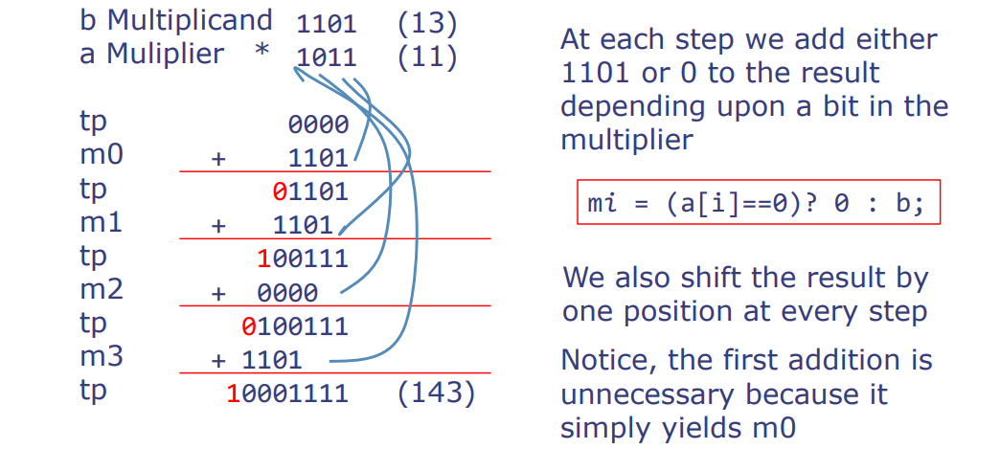

# L07-Complex Combinational Circuits in Bluespec

MIT 6.004 2019 L07 Complex Combinational Circuits in Bluespec，由教授Arvind讲述。

这次讲座的主题为：Bluespec 中的复杂组合电路

## 主要内容

1. **组合电路回顾**：在前两次课程中介绍了组合电路，并展示了如何使用Bluespec语言编写一些简单的组合电路。今天，我们将着手解决更复杂的组合电路，并探讨新出现的问题。

2. **Bluespec语言的重要性**：Bluespec是一种硬件设计语言，通过它，我们可以像绘图一样表达电路，电路由门和连线等元素构成。与普通的绘图程序（如PowerPoint）不同，Bluespec中的盒子（即门）具有明确的计算含义，可以基于输入推断输出。

3. **电路仿真的重要性**：Bluespec不仅可以设计电路，还可以对电路进行仿真，以验证给定输入下的输出。这是设计前验证电路正确性的关键步骤。

4. **Bluespec编译器的功能**：Bluespec编译器的主要目的是帮助设计高效的电路，仿真功能是额外的优势。过去，电路设计常常需要手动完成，但现在借助Bluespec，即使是复杂的电路也可以仿真。

5. **电路的输入输出行为**：在讨论电路的功能时，并非专指电路的实际生成，而是指电路的输入输出行为。

6. **32位加法器的例子**：通过Bluespec循环结构来展示如何构建32位加法器，这种方法不仅节省了重复代码的工作，而且减少了出错的可能性。

7. **类型系统的介绍**：Bluespec的类型系统帮助硬件设计师避免错误的连接，提供了强大的参数化功能，可以通过修改参数来轻松改变电路的规模。

8. **参数化电路的概念**：参数化电路可以根据需要实例化为不同大小的电路，这是硬件设计中的一个高级概念。

9. **类型错误和类型推导**：Bluespec强类型系统可能在初学者使用时会遇到一些挫折，但一旦熟悉，它可以极大地减少错误，并简化程序的编写。

10. **强类型语言的优势**：在强类型语言中，每个表达式都有类型，这有助于避免许多错误。例如，使用枚举类型声明可以防止不同类别的值被错误地比较或混淆。

11. **使用let语法简化类型声明**：Bluespec提供的let语法可以减轻程序员声明类型的负担，允许编译器自动推断表达式的类型。

12. **类型推导和类型错误检测**：编译器可以检测并指出代码中的类型不一致之处，从而减少编程错误。如果出现类型错误，编译器会拒绝编译并提供错误信息。

13. **循环和函数的展开**：Bluespec中的循环和函数在编译时会被展开，生成无环的门图，这确保了电路的正确设计。

14. **参数化类型的高级概念**：参数化类型允许创建具有广泛适用性的电路描述，这些电路可以根据参数变化自由扩展。

15. **数字类型的使用**：在Bluespec中，可以将数字用作类型，这允许设计者创建更具表现力的类型定义，如将数字用作向量的尺寸或其他类型的参数。

---

# 分页知识点

### Bluespec 用于描述电路

- Bluespec是用于描述电路的一种语言，就像绘制互连箱的图画一样。
- 这些箱子实际上是带有输入和输出的布尔门。
- 然而，不同于普通图画，我们的箱子，即门，有计算意义，因此我们可以询问，在特定的输入值集上，一个电路将在其输出线上产生什么值。
- 尽管Bluespec编译器的主要目的是合成门网络，但能够模拟结果电路的功能也非常重要。

Bluespec是一个用于描述电路的语言，特别是在布尔逻辑和组合电路的上下文中。它允许设计者以类似于绘图的方式来构建和表示电路，其中每个盒子代表一个布尔门，具有确定的逻辑功能和计算意义。这样的表示法不仅便于理解和设计电路，而且通过Bluespec编译器的合成功能，可以转换为物理硬件门的网络。

此外，Bluespec还具有模拟电路功能的重要性，即在电路设计和验证过程中，设计者可以检查和测试电路在给定特定输入集时的行为，确保设计满足预期的功能和性能规格。这种模拟是验证复杂电路设计正确性的关键步骤，确保在硬件实现之前电路设计没有逻辑错误。

### Bluespec：门合成与仿真 - 2位加法器

```rust
// 定义一个返回3位宽位向量的函数add2，接受两个2位宽的参数x和y
function Bit#(3) add2(Bit#(2) x, Bit#(2) y);
    // 初始化和s和进位c为0
    Bit#(2) s = 0; // 和s是一个2位宽的位向量
    Bit#(3) c = 0; // 进位c是一个3位宽的位向量，包括最初的进位c[0]
    c[0] = 0; // 最低位的进位初始化为0
    // 使用全加器fa计算第0位的和与进位
    Bit#(2) cs0 = fa(x[0], y[0], c[0]); // cs0包含第0位的和与进位
    s[0] = cs0[0]; // 将第0位的和存入s[0]
    c[1] = cs0[1]; // 将第0位的进位存入c[1]，作为下一位的进位输入
    // 使用全加器fa计算第1位的和与进位
    Bit#(2) cs1 = fa(x[1], y[1], c[1]); // cs1包含第1位的和与进位
    s[1] = cs1[0]; // 将第1位的和存入s[1]
    c[2] = cs1[1]; // 将第1位的进位存入c[2]，这是最终的进位输出
    // 函数返回一个位向量，包含最高的进位和2位宽的和
    return {c[2],s}; // 最高位c[2]是整个加法的进位输出，s是两位的和
endfunction
```

- `add2(2'b11, 2'b01)` => `3'b100` // 二进制11（即十进制3）加上01（十进制1）等于100（十进制4）
- `add2(2'b01, 2'b01)` => `3'b010` // 二进制01（即十进制1）加上01（十进制1）等于010（十进制2）

注意：尽管Bluespec程序可以像其他软件语言那样产生输出，但Bluespec程序的主要目的是为了描述硬件电路。[全加器fa](L05.html?highlight=fa#全加器fa)

在这个例子中，我们看到了Bluespec语言中函数的声明和位向量的操作。通过`Bit#(n)`语法，Bluespec能够明确指定变量所能容纳的位宽，这在硬件设计中是基础且必要的。函数`add2`通过调用全加器`fa`计算每一位的和与进位，然后将计算结果组合返回。这个过程在硬件设计中是通过门电路实现的，Bluespec提供了一个高级的方法来表达这些门电路，并允许仿真这些电路以验证其行为。

### 编译Bluespec到电路

在这个过程中，Bluespec设计通过Bluespec编译器编译成独立于技术的门描述。这些描述进一步通过Verilog编译器转换为网表，这些网表是建立在特定技术（例如22nm工艺）的门库上。

#### 静态展开（Static elaboration）
Bluespec编译器消除了所有没有直接硬件意义的构建，例如：
- 所有数据结构都被转换成位向量（bit vectors）。
- 循环（loops）被展开。
- 函数（functions）被内联（in-lined）。
- 最后剩下的是一个布尔门（Boolean gates）的无环图（acyclic graph）。
  - 如果编译器在你的电路中检测到一个循环，它会报错。

这个过程确保了Bluespec设计能够有效地转换成硬件实现。例如，在Bluespec中使用的高级数据结构和控制流结构在编译后都会被转换为可以在硬件中实现的形式。这种转换确保了高级抽象在硬件层面得到了正确的表达和实现。而对循环的处理则意味着在硬件设计中避免了潜在的循环依赖，从而确保了生成的硬件电路的正确性和效率。

#### 补充：术语解释

**位向量**（Bit Vectors）

位向量是一个一维的二进制数字数组，用于表示多个数字或信号的集合。在硬件设计中，它们用于表示寄存器、总线和其他数字信号的值。位向量允许设计者在单个变量中处理多个位，对数字电路进行建模。

**循环展开**（Loop Unfolding）

在硬件描述语言中，循环展开是将循环结构转换为重复的语句块的过程。由于硬件执行是并行的，不能像软件程序那样实时计算循环，因此必须将循环转换为一系列的硬件实现。循环展开确保每次迭代中使用的硬件资源都被明确定义，从而避免了硬件设计中的动态控制结构。

**内联**（In-lining）

内联是一种编译时优化技术，它将函数调用替换为函数体本身的过程。在硬件设计中，这意味着用函数体替换每个函数调用，减少了函数调用开销，直接插入函数代码可以减少需要的控制逻辑，减小延迟，并可能降低电路的整体复杂性。

**布尔门**（Boolean Gates）

布尔门是实现布尔函数的基本硬件设备。例如，与门（AND）、或门（OR）、非门（NOT）等实现了基本的布尔运算。每个布尔门都接受一个或多个二进制输入，产生一个二进制输出。在电路设计中，这些基本单元被组合成复杂的逻辑电路，以实现更复杂的运算和控制结构。

**无环图**（Acyclic Graph）

无环图是一种图，其中不存在从任何顶点开始并最终返回到同一顶点的路径。在硬件电路设计中，这意味着信号的流动是单向的，从输入端到输出端没有循环或反馈路径。这是重要的，因为任何类型的反馈都可能导致不稳定或振荡，而这在设计可靠的数字电路时是不可接受的。

### 32位进位链加法器（RCA）

我们本可以显式地写出RCA的链，但我们也可以使用循环！

```rust
// 定义一个函数来实现32位进位链加法器
function Bit#(33) add32(Bit#(32) x, Bit#(32) y, Bit#(1) c0);
    // 初始化和（sum）和进位（carry）变量
    Bit#(32) s = 0;
    Bit#(33) c = 0;
    c[0] = c0; // 将初始进位设置为c0

    // 使用循环来实现32位的加法，每次循环处理一个比特位
    for (Integer i=0; i<32; i=i+1) begin
        // 调用全加器fa，处理当前位的x、y及进位
        Bit#(2) cs = fa(x[i],y[i],c[i]);

        // 将全加器输出的和（sum）存储到s变量
        // 并将进位输出存储到下一个进位位置
        c[i+1] = cs[1];
        s[i] = cs[0];
    end

    // 返回32位的结果和最高进位
    return {c[32],s};
endfunction
```

该代码定义了一个名为`add32`的函数，它将两个32位的位向量`x`和`y`作为输入，并返回一个33位的结果（32位和一个进位）。这里使用了一个for循环，这个循环从0迭代到31（共32次），在每次迭代中，它都会调用一个全加器函数`fa`来计算对应位的和及产生的新进位。循环的每次迭代都对一个比特位的加法进行处理，并将结果存储在`s`变量中，进位存储在`c`变量中。

在此，`Bit#(n)`是Bluespec中表示宽度为`n`位的位向量类型。例如，`Bit#(32)`是一个32位的位向量，`Bit#(1)`是一个单比特。`fa`函数是全加器，它接受两个输入比特`x[i]`和`y[i]`，以及进位`c[i]`，然后返回一个两位数的结果，`cs[0]`是和，`cs[1]`是新的进位。

最终，函数返回的是一个33位的位向量，其中最高位是最终的进位`c[32]`，其余32位是加法结果`s`。这个函数体现了硬件描述语言在设计大规模数字电路时的强大功能，尤其是当设计中涉及到重复性结构时，循环提供了一种高效且紧凑的方式来描述这种结构。

### 32位进位链加法器的工作原理：

一个进位链加法器由一系列的全加器组成，每个全加器都对应于输入数位向量的一个位。在每一位上，全加器会将两个输入数的相应位以及从前一位获得的进位相加。这个过程从最低位开始，逐位向高位进行，进位依次传递。

假设我们要将两个32位的二进制数`X`和`Y`相加，并且没有初始的进位输入（即c0 = 0）。我们可以用如下的伪代码来表示这个操作：

```rust
function add32(X, Y, c0)
    初始化和(S)为0
    初始化进位向量(C)为0，且C[0]设为c0（初始进位）

    对于 i 从 0 到 31（含32位）
        使用全加器对 X[i], Y[i], 和 C[i] 进行加法操作
        将全加器的和输出存储到 S[i]
        将全加器的进位输出存储到 C[i+1]

    返回最终的和 S 和最高位的进位 C[32]
end function
```

**具体的示例**：

为了更清晰地理解，我们用两个具体的32位数来演示：

- 数字`X` = 32'b1011...（32位中只有最后四位是1011，其余都是0）
- 数字`Y` = 32'b1100...（32位中只有最后四位是1100，其余都是0）

在Bluespec函数`add32`中：

1. 初始化 S 和 C 为全0。
2. 循环从 i=0 到 i=31：
   - 第一次迭代（i=0）：
     - `X[0]` = 1, `Y[0]` = 0，C[0]（初始进位）= 0。
     - 全加器计算：1 + 0 + 0 = 1（和），进位 = 0。
     - S[0] = 1，C[1] = 0。
   - 第二次迭代（i=1）：
     - `X[1]` = 1, `Y[1]` = 1，C[1] = 0（上一步的进位）。
     - 全加器计算：1 + 1 + 0 = 0（和），进位 = 1。
     - S[1] = 0，C[2] = 1。
   - ...以此类推，直到最后一个位。

3. 完成循环后，我们得到最终的和 S 和最高位的进位 C[32]。

最终输出的和 S 将是两个数相加的结果，C[32] 是最高位的进位，如果这个进位为1，则意味着最终的和超出了32位，表明溢出。

请注意，实际的硬件设计中全加器会是预定义的组件，Bluespec编译器会将这些循环和函数调用转换成具体的硬件逻辑。

### 回到32位进位链加法器

```rust
for (Integer i = 0; i < 32; i = i + 1) begin
    Bit#(2) cs = fa(x[i], y[i], c[i]);
    c[i+1] = cs[1];
    s[i] = cs[0];
end
```

展开循环后：

```rust
cs = fa(x[0], y[0], c[0]);
c[1] = cs[1];
s[0] = cs[0];

cs = fa(x[1], y[1], c[1]);
c[2] = cs[1];
s[1] = cs[0];

...

cs = fa(x[31], y[31], c[31]);
c[32] = cs[1];
s[31] = cs[0];
```

循环体内的`cs`是一个局部变量。因此，每个`cs`都指向一个不同的值。我们也可以将它们命名为`cs0`, `cs1`, ..., `cs31`。

**补充解释**：

在这个32位进位链加法器的例子中，`for`循环是用来重复执行全加器`fa`的计算，对于输入向量`x`和`y`的每一位，以及上一位的进位`c[i]`。全加器将这三个值相加，并生成两个输出：和（`s[i]`）和新的进位（`c[i+1]`）。

在循环中，变量`cs`是一个两位宽的位向量（`Bit#(2)`），其中`cs[0]`是和的结果，`cs[1]`是新的进位。每次迭代，`cs`会获取新的值，因为每次调用全加器时输入都不同。实际上，我们可以把每次迭代的`cs`视为不同的实体，如`cs0`, `cs1`等等。

将循环展开是硬件描述语言（HDL）常见的做法，目的是明确每个步骤中使用的具体硬件单元。这个展开过程通常是编译器在从高级硬件描述语言转换为低级硬件设计时自动执行的。展开后的结果显示了32个全加器按顺序排列，展示了从输入位到最终和位的完整路径。每个全加器处理一对输入位和进位，并产生新的和位和进位。这个过程从`x[0]`, `y[0]`, `c[0]`开始，一直到`x[31]`, `y[31]`, `c[31]`，最后产生32位和向量`s`和最终的进位`c[32]`。

### 循环到门

这部分描绘了如何从逻辑循环创建出硬件门的过程。在这个特定的例子中，我们看到一个32位进位链加法器（Ripple-Carry Adder, RCA）是如何通过展开循环来生成的，以及每次迭代中使用的全加器（full adder, fa）如何相互连接。

在原始代码中的循环，使用全加器函数`fa`连续计算32位加法：

```rust
cs0 = fa(x[0], y[0], c[0]);
c[1] = cs0[1]; s[0] = cs0[0];

cs1 = fa(x[1], y[1], c[1]);
c[2] = cs1[1]; s[1] = cs1[0];

...

cs31 = fa(x[31], y[31], c[31]);
c[32] = cs31[1]; s[31] = cs31[0];
```

展开后的循环定义了一个无环的连接图：


每个调用全加器`fa`的实例都被其实体替换。

在这个图示中，原本在循环结构中的每次迭代实际上被转换为一个全加器实体，并排列成一系列硬件门。全加器是基本的计算单元，负责两个位的加法并考虑进位。

`cs0`, `cs1`, ..., `cs31`是全加器产生的中间结果，其中包含和（s）和新的进位（c）。展开这个循环就意味着创建了一个无环的连接图，这是硬件实现中很重要的概念，因为硬件电路必须是无环的，以确保信号可以从输入流向输出，没有任何回环。

在这个连接图中，我们看到输入向量`x`和`y`的每一位以及进位信号`c`被逐个传递给相应的全加器，然后全加器产生相应位的和（s）和下一位的进位（c）。这个过程最终生成了一个32位宽的和向量`s`和一个额外的进位位`c[32]`。这种逐步计算的方式体现了进位链加法器的名称，因为每一位的计算可能依赖于前一位的计算结果，形成了一个“进位链”。

### 通过重复加法实现乘法

这部分展示了如何通过重复加法来实现二进制乘法操作。图中的流程展示了将一个乘数（multiplier）逐位地与另一个乘数（multiplicand）相乘的过程，这是计算机硬件中乘法器的典型实现方法。



- b 乘数（multiplicand）：1101（十进制中的 13）
- a 乘数（multiplier）：* 1011（十进制中的 11）

在每一步，我们根据乘数的一个比特，要么将 1101 或 0 加到结果中。

```plaintext
m[i] = (a[i] == 0) ? 0 : b;
```

在每一步我们也将m[i]向移动一个位置。注意，第一次加法是不必要的，因为它只产生了 m0。让我们再讲解一下这个重复加法的乘法过程：

1. 在每一步，我们根据乘数 `a` 当前位 `ai` 的值决定是添加被乘数 `b` 或者是 0 到暂存的乘积 `tp` 上。这是通过 `mi` 来实现的，如下所示：
   - 如果 `ai` 是 1，则 `mi = b`。
   - 如果 `ai` 是 0，则 `mi = 0`。
2. 接着，将 `mi` 加到 `tp` 上。
3. **在下一步开始之前**，我们将 `mi`向左移动一位。这是因为每向左移动一位相当于乘以 2（也就是说，在二进制下，相当于将数字提高一个位权重），以反映在下一步中 `mi` 所代表的值在位权重上的增加。

在上述的例子中，我们将 13 和 11 相乘：

- 在第一步，我们有 `m0 = 1101`（因为 `a0` 是 1），我们把 `m0` 加到 `tp` 上，得到 `tp = 1101`。
- 然后我们需要将 `m0`（现在为 `1101`）向左移动一位得到 `m1`（现在为 `11010`），因为我们在处理乘数的下一位。
- 接下来的每一步都重复这个过程，根据乘数的下一位决定 `mi` 是 `b` 还是 0，然后把它加到 `tp` 上，并且在进行下一步之前将 `mi` 向左移动一位。最终结果是两个数的乘积，即二进制 10001111 或十进制 143。

整个过程中，`tp` 是暂存的乘积，最终是累积的结果。mi` 在每一步后会向左移动，以反映其在二进制中位权重的提高。

在硬件设计中，这个过程通常是自动化的，通过硬件乘法器电路实现，它能够快速有效地执行这些操作。这个过程也显示了乘法可以通过一系列的加法和移位操作来完成，这是计算机内部进行乘法的基础原理。

在硬件设计中，这个过程通常是自动化的，通过硬件乘法器电路实现，它能够快速有效地执行这些操作。这个过程也显示了乘法可以通过一系列的加法和移位操作来完成，这是计算机内部进行乘法的基础原理。

### 通过重复加法实现的乘法电路


对于这个乘法运算，右侧的电路图展示了这个逻辑表达式如何在硬件中实现。每一个 `mi` 通过一个四位加法器（`add4`）与之前的 `tp` 相加，产生新的 `tp` 值。每一步的 `mi` 是通过检查 `ai` 并决定是传递 `0` 还是 `b` 来实现的。这里用到了一个选择器（multiplexer），基于 `ai` 的值，选择 `0` 或 `b`。

为了更好的理解，我们可以将这个过程中的每一步看作是一个迭代，每次迭代处理一个 `ai` 位，并更新 `tp`。通过在每一步将 `mi` 向左移位，我们确保了加法是在正确的位权重上进行的。

在乘法过程中，`mi` 的左移也意味着加法器处理的位置向左（即向更高的位）移动了，因此每一步得到的结果位会逐渐填充到最终结果的对应位置。这也就是为什么每次加法后的最低位可以直接成为最终结果的一部分，因为后面的加法操作会在更高位进行，不会影响到已经确定的低位结果。这个过程在硬件设计中体现出累加的乘积如何在不同的时钟周期内构建，最终形成了乘法的总和。

这个电路的设计体现了计算机组成中的一项基本概念：通过组合简单的组件（如加法器和选择器），我们能够构建出完成复杂运算的硬件结构。

### 组合式32位乘法器（Combinational 32-bit multiply）

```rust
// 定义一个函数，接受两个32位的输入参数a和b，返回一个64位的结果
function Bit#(64) mul32(Bit#(32) a, Bit#(32) b); 
  Bit#(32) tp = 0; // 定义一个临时乘积变量，初始化为0
  Bit#(32) prod = 0; // 定义最终乘积变量，初始化为0
  // 循环32次，实现乘法运算
  for(Integer i = 0; i < 32; i = i+1) begin
    Bit#(32) m = (a[i]==0)? 0 : b; // 如果乘数a的第i位为0，则m为0；否则为被乘数b
    Bit#(33) sum = add32(m,tp,0); // 调用add32函数将m和tp进行加法运算，并添加0作为进位输入
    prod[i] = sum[0]; // 将加法结果的最低位存储到最终乘积的第i位
    tp = sum[32:1]; // 更新tp，为下一轮迭代准备
  end
  return {tp,prod}; // 返回最终乘积结果，64位
endfunction
```

这段代码展示了如何在硬件设计中通过组合逻辑实现32位的乘法器。在这里，我们使用了一个`for`循环来模拟乘法过程：每一次迭代中，我们检查乘数`a`的当前位，如果该位为1，则将被乘数`b`添加到临时乘积`tp`上；如果为0，则不添加。每次添加后，我们都将临时乘积`tp`向左移动一位，以便下一位的加法。这里的`add32`函数负责执行加法操作，并返回加法的结果和新的进位值。

#### 分析32位乘法器

- **我们能设计一个更快的加法器吗？** 答案是肯定的，通过优化加法器的设计可以减少传播延迟。
- **我们能否重用加法器电路，并减小乘法器的大小？** 请继续关注，解决方案即将揭晓。

**长门链（Long chains of gates）**：32位乘法器序列中有32个逐级传递的加法器。32位逐级传递的加法器有一个32长的门链。

**思考题：32位乘法器的传播延迟是多少？**

- 加法器的传播延迟通常取决于全加器（FA）的延迟。考虑到一个32位的加法器可能由32个全加器组成的链，我们需要计算这个链中每个全加器的延迟相加的结果。

在这里的分析中，重要的是要理解传播延迟的计算对于确定电路的性能至关重要。通过优化这些延迟，可以实现更快的硬件设计。

### n位逐级传递加法器（n-bit Ripple-Carry Adder）

```verilog
// 定义一个泛型函数，实现一个n位逐级传递加法器，输入参数是两个n位数和一个进位位
function Bit#(n+1) addN(Bit#(n) x, Bit#(n) y, Bit#(1) c0); 
  Bit#(n) s = 0; // 定义一个n位的和数变量，初始化为0
  Bit#(n+1) c = 0; // 定义一个(n+1)位的进位变量，初始化为0
  c[0] = c0; // 将输入的进位位赋给进位变量的最低位
  // 循环n次，每次处理一位加法，并处理进位
  for (Integer i=0; i<n; i=i+1) begin
    let cs = fa(x[i],y[i],c[i]); // 调用全加器函数fa处理当前位的加法和进位
    c[i+1] = cs[1]; // 将全加器返回的进位存储到进位变量的下一位
    s[i] = cs[0]; // 将全加器返回的和存储到和数变量的当前位
  end
  return {c[n],s}; // 返回一个(n+1)位的结果，最高位是最终的进位，其余位是和数
endfunction
```

这部分展示了一个泛型的n位逐级传递加法器（Ripple-Carry Adder, RCA）的代码实现。

代码中的`addN`函数是参数化的，这意味着可以通过指定参数`n`的值来创建不同大小的加法器。例如，如果我们需要一个8位加法器，我们可以调用`addN`并将`n`设置为8。

遗憾的是，这段代码存在类型错误。由于类型系统的复杂性，在硬件描述语言中，这些错误可能不太直观，因此需要细心地检查以确保类型的正确性。这些错误可能包括不正确的位宽定义或错误的类型运算，如尝试对类型参数进行算数运算。

- **现在可以通过指定`n`来实例化不同大小的加法器。** 这展示了硬件描述语言的强大功能，可以创建可配置且重复使用的硬件组件。
- **不幸的是，这个程序中有一些微妙的类型错误 - 我们将一一解决它们。** 在硬件设计中，类型错误可能会导致电路实现不正确或仿真失败，因此在实现之前需要对代码进行严格的类型检查和调试。

该加法器实现的关键点在于，它使用了循环结构来代替显式编写的长加法器链。通过这种方式，设计者可以避免代码冗余，更容易维护和更新电路设计。然而，要正确地使用这种方法，设计者需要深入理解如何在其硬件描述语言中处理类型，以及如何确保泛型代码的正确性和可重用性。
