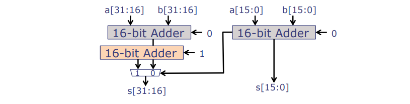
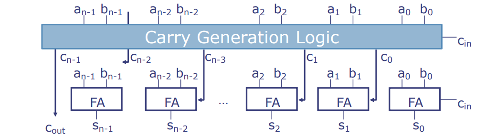
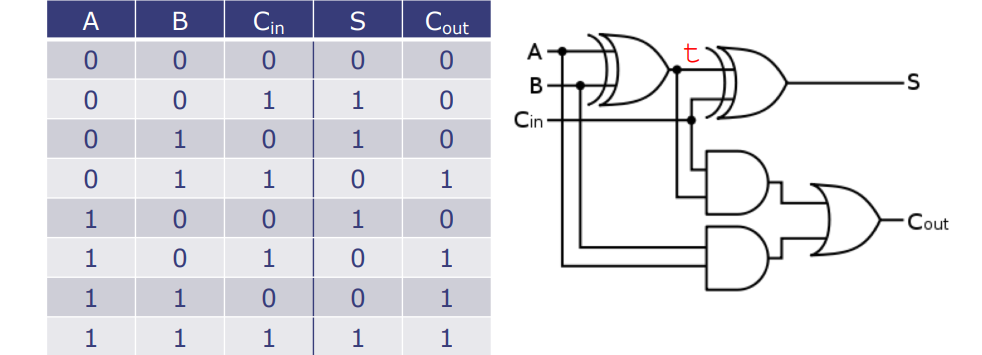
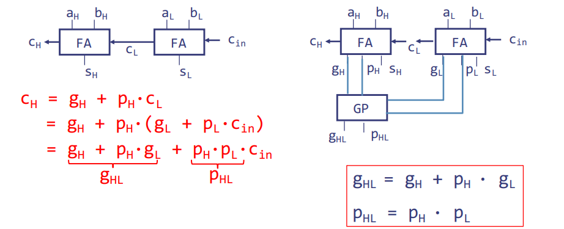
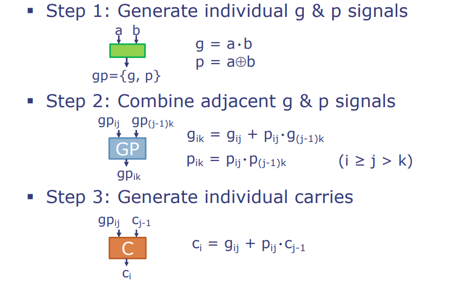

# L08-Design Tradeoffs in Arithmetic Circuits

---

MIT 6.004 2019 L08 Design Tradeoffs in Arithmetic Circuits，由教授Arvind讲述。

这次讲座的主题为：算术电路中的设计权衡。

## 主要内容

1. **组合逻辑讲座**：
- 这是关于组合逻辑的最后一讲，之后的课程将转向时序逻辑学习，这也是一个非常有趣的话题。
- 本周四将有一次测验，已经安排了复习课程。

2. **算术电路中的设计折衷**：
- 硬件设计中算法的折衷是一个非常有趣的话题。设计算术电路可以说是没有穷尽的，理论家和实践者都在这个领域工作。
- 需要进行多维优化，我们希望最小化电路占用面积，同时也希望最小化延迟（即输入到输出的时间），而功率消耗则稍后在课程中讨论。
- 在选择算法时需要有高层次的理解，因为在硬件中对算法的折衷与在软件中不同。例如，有些算法可能在某些情况下效果非常好，因为我们需要更好的硬件。

3. **算法在硬件设计中的应用**：
- 你需要能够用一种高级描述语言表达你的算法，然后输入到编译器中生成代码。工具可以做很多优化，有时候会出现意外的结果。
- 理论上我们需要了解为什么某个算法比另一个更好，但实践中我们也需要看到这是否真的如此。

4. **快速加法器的设计**：
- 我们将讨论一个快速加法器的设计，这并不是一个虚构的问题。当我们设计时序电路和像RISC-V这样复杂的处理器时，我们会关心运行速度，你会发现加法器往往是拖慢速度的因素。

5. **重温Ripple-Carry Adder**：
- Ripple-Carry Adder在设计中很容易实现。如果试图理解它的延迟，最糟糕的情况是进位信号需要从最不重要的位一直传递到最重要的位。
- 我们使用Big O表示法（如O(n)）来表示电路的延迟与操作数的数量成正比。

6. **Carry-Lookahead Adders（CLA）**：
- CLA的关键想法是将携带的链转换为树，这种转换是为了加速进位信号的生成。
- 在CLA中，我们使用generate和propagate概念，这些不依赖于进位信号的值，这给我们一个机会来组成这些进位信号。
- 最终，我们可以在对数时间内（如log n）生成所有进位信号。

7. **加法器性能和面积**：
- 讲座最后，讨论了不同加法器的性能和它们占用的面积。例如，与基本的Ripple-Carry Adder相比，递归的Carry Select Adder有更快的性能，但占用的面积更大。
- Carry-Lookahead Adder在面积和性能上都表现得更好，但相比于最基本的加法器，它们的面积占用显著增加。
- 这些优化的加法器有助于提升整个机器的运行速度，因为如果不够快，整个机器可能都会变慢。

8. **综合总结**：
- 选择正确的算法对设计至关重要。如果你的算法不好，你无法弥补一个糟糕的设计。
- Carry-Lookahead Adders可以进行O(n)数量级的加法运算，尽管付出了一些面积成本。
- 这种技术可以用来优化广泛的电路类别，因此需要深入研究这些内容，它们对你的项目也将是非常有用的。

# 分页知识点

### 算法在硬件设计中的权衡
- 每个功能都允许许多实现方式，这些方式在延迟、面积和功耗方面有着广泛的权衡。
- 选择正确的**算法**对于优化设计至关重要：
  - 工具无法补偿效率低下的算法（在大多数情况下）。
  - 这就像编程软件一样。
- 案例研究：构建一个更好的加法器。

在硬件设计中，每一个电路功能都可以通过不同的实现方法来达成，而这些不同的实现方法之间存在着一系列的权衡。例如，某些设计可能在减少电路延迟（即从输入到输出所需时间）方面更加有效，但可能需要更多的硬件面积（即占用更多的芯片空间）或者更高的功耗。相对的，其他设计可能使用更少的空间或消耗更少的能量，但在处理信号时会更慢。

关键在于选择正确的算法，这是优化硬件设计的关键步骤。正如软件开发中算法的选择对程序性能有着决定性影响一样，硬件电路设计也需要以高效的方式组织逻辑和计算过程。硬件描述语言和综合工具可以帮助设计师从高层次的电路描述中生成优化的硬件实现，但它们不能完全替代一个本身就高效的算法。如果算法设计得不好，即便是使用最先进的综合工具，也无法达到最佳的硬件性能。

### 级联进位加法器：简单但慢

#### 最坏情况路径：

**从LSB到MSB的进位传播，例如，将 11...111 加到 00...001 时**


- \\( t_{PD} = (n-1) * t_{PD,C\rightarrow CO} + t_{PD,CI\rightarrow S} \approx \Theta(n) \\)
- Q(n) 读作 "n阶(order n)"，告诉我们加法器的延迟与操作数的位数成线性增长关系

级联进位加法器是一种基本的数字加法器设计，它将两个n位的二进制数进行相加。在这个设计中，每一个位的进位输出（CO）都是下一个位的进位输入（CI）。由于这种设计，最坏的延迟情况发生在进位必须通过所有位传播时，例如，从最低有效位（LSB）到最高有效位（MSB）。在这种情况下，整个加法操作的时间取决于每个全加器的进位延迟时间（\\( t_{PD,C\rightarrow CO} \\)），乘以位数减一（因为最后一位没有下一位），再加上最后一位的和输出延迟时间（\\( t_{PD,CI\rightarrow S} \\)）。

这里的公式 \\( t_{PD} \\) 表示整个加法器的传播延迟时间，大致与操作数的位数（n）成线性关系，即随着位数的增加，延迟时间线性增长。这是由大写希腊字母 Θ（Theta）所表示的，通常用来描述算法的时间复杂度。在这里，Θ(n)意味着延迟时间和操作数的位数成正比。

从硬件设计的角度来看，级联进位加法器因其简单和直观的设计而受到青睐，尤其是在位数不多的情况下。然而，在设计需要处理大量位数的高速计算硬件时，其性能可能会成为瓶颈。因此，工程师和设计师可能会探求其他类型的加法器设计，比如超前进位加法器（carry-lookahead adder），以提高性能和减少计算延迟。


### 渐近分析

#### 假设某些计算需要执行 \\( n^2+2n+3 \\) 步骤
- 我们说它需要 \\( \Theta \\) (\\( n^2 \\))（读作“n平方阶”）步骤
- 为什么？因为 \\( 2n^2 \\) 总是大于 \\( n^2+2n+3 \\)，除了几个小整数（1，2 和 3）

正式地说，\\( g(n) = \Theta(f(n)) \\) 当且仅当存在 \\( C_2 > C_1 > 0 \\)，对于除了有限多个整数 \\( n \geq 0 \\) 外，都有 \\( C_2 \cdot f(n) \geq g(n) \geq C_1 \cdot f(n) \\)

- \\( g(n) = O(f(n)) \\) 
- \\( \Theta \\) (…)表示两个不等式都成立；
- \\( O \\) (…)只表示第一个不等式成立。

#### 解释及补充内容
在计算机科学中，渐近分析是评估算法运行效率的重要工具。它不是测量算法的实际运行时间，而是分析算法性能如何随着输入大小的增加而变化。

例如，对于一个算法，如果计算步骤的总数是输入大小 \\( n \\) 的二次函数，即 \\( n^2+2n+3 \\)，我们可以用大写的 Theta（\\( \Theta \\) ）来表示它的渐近运行时间。在这种情况下，我们关注 \\( n^2 \\) 项，因为它在 \\( n \\) 较大时主导总步骤数。当 \\( n \\) 足够大时，\\( 2n \\) 和常数 3 相比于 \\( n^2 \\) 变得不重要。

在这里，\\( g(n) = \Theta(f(n)) \\) 表示 \\( g(n) \\) 的增长速率和 \\( f(n) \\) 一致。实际上，这意味着存在常数 \\( C_1 \\) 和 \\( C_2 \\)，使得 \\( g(n) \\) 始终在 \\( C_1 \cdot f(n) \\) 和 \\( C_2 \cdot f(n) \\) 之间。对于大多数 \\( n \\) 的值，\\( g(n) \\) 不会低于 \\( C_1 \cdot f(n) \\)，也不会超过 \\( C_2 \cdot f(n) \\)。

大 O（ \\( O \\)）符号用于表示上界，即 \\( g(n) = O(f(n)) \\) 表示 \\( g(n) \\) 的增长速率不会超过 \\( f(n) \\) 的增长速率的某个常数倍。这通常用于最坏情况分析。

#### 举个例子：

在渐近分析中，假设我们有一个函数 \\( f(n) = n^2 + 2n + 3 \\) 来表示算法或硬件电路的性能，如时间复杂度或所需步骤数。我们说这个函数是 \\( O(n^2) \\) 的阶，即 "order \\( n^2 \\)"。这里的 \\( O \\) 是大O符号，用于描述最坏情况的上界。

为什么是这样的？因为当 \\( n \\) 足够大时，\\( n^2 \\) 项是支配项，也就是说它对结果的影响最大。实际上，存在两个常数 \\( C_1 \\) 和 \\( C_2 \\) （其中 \\( C_2 > C_1 > 0 \\)），使得对于所有足够大的 \\( n \\)，我们有：

\\\[ C_1 \cdot n^2 \leq n^2 + 2n + 3 \leq C_2 \cdot n^2 \\\]

这里的 \\( g(n) = n^2 + 2n + 3 \\)，\\( f(n) = n^2 \\)。

例如，可以取 \\( C_1 = 1 \\) 和 \\( C_2 = 4 \\)。这样，对于所有足够大的 \\( n \\)，不等式保持为真：

\\\[ n^2 \leq n^2 + 2n + 3 \leq 4n^2 \\\]

这两个不等式分别保证了 \\( g(n) \\) 的下界和上界。在大 \\( n \\) 的值时，2n 和 3 相对于 \\( n^2 \\) 来说不太重要，所以我们通常关注 \\( n^2 \\) 项。

要注意的是，\\( C_1 \\) 和 \\( C_2 \\) 的确切值并不重要，重要的是存在这样的常数使得这些不等式成立。实际中，你可能不会计算这些常数，而是知道对于大的 \\( n \\)，主要的增长趋势是由 \\( n^2 \\) 决定的。

大O符号 \\( O(...) \\) 只保证了上界，即 \\( g(n) \\) 不会增长得比 \\( f(n) \\) 快得多。而渐近紧确界 \\( \Theta(...) \\) 同时保证了上界和下界，说明 \\( g(n) \\) 的增长率被 \\( f(n) \\) 紧密包围。在这个例子中，因为 \\( g(n) \\) 实际上就是由 \\( n^2 \\) 的项主导，所以我们也可以说 \\( g(n) \\) 是 \\( \Theta(n^2) \\)。

#### 举个不一样的例子：

- 如果 \\( g(n) = 100n^2 \\)，那么它既是 \\( O(n^2) \\) 也是 \\( \Theta(n^2) \\)。
- 如果 \\( g(n) = n^2 + 10n \\)，那么它也是 \\( O(n^2) \\) 和 \\( \Theta(n^2) \\)，因为 \\( n^2 \\) 项仍然是支配项。
- 如果 \\( g(n) = n \log n \\)，那么它是 \\( O(n^2) \\)（因为 \\( n \log n \\) 的增长速度比 \\( n^2 \\) 慢），但它不是 \\( \Theta(n^2) \\)，因为没有任何常数 \\( C_1 \\) 使得 \\( C_1 \cdot n^2 \leq n \log n \\) 对于所有足够大的 \\( n \\) 都成立。在这种情况下，\\( n \log n \\) 的增长率显然低于 \\( n^2 \\)。

因此，\\( \Theta \\) 通常在我们已经了解算法或电路性能的确切特性时使用，而 \\( O \\) 更多地用于上界分析，特别是在我们只关心不超过某种特定增长率时。

这些概念对于硬件设计同样重要，因为它们可以帮助设计者理解和预测硬件组件在处理更大规模数据时的表现。在硬件中，我们可能关心的“步骤”可能是信号在电路中传播的时间或逻辑门的切换次数，而不仅仅是算法中的计算步骤。渐近分析允许设计者预估电路设计在不同输入大小下的表现，以确定其可伸缩性和潜在的性能瓶颈。

### 选择加法器（CSA）牺牲面积换取速度

选择加法器（Carry-Select Adder, CSA）通过牺牲芯片面积（即硬件资源）来提高计算速度。该加法器的设计原理如下：

- 将两组输入的32位数分别划分为高16位和低16位。
- 对每一部分，分别计算两个可能的和：一个假设来自低16位的进位为0，另一个假设进位为1。
- 低16位加法器的进位输出用于选择上述两个高16位加法器结果中的正确和。



**传播延迟（Propagation delay）:**

\\[ t_{pd,32} = t_{pd,16} + t_{pd,MUX} \\]

这里的 `t_{pd,32}` 表示32位选择加法器的传播延迟，`t_{pd,16}` 是16位加法器的传播延迟，`t_{pd,MUX}` 是多路选择器（MUX）的传播延迟。使用16位纹波进位加法器作为基础组件时，这种设计能将32位纹波进位加法器的延迟减半。

然而，这种设计有一个明显的缺点：它比纹波进位加法器消耗**更多的面积**。此外，宽多路选择器（Wide MUX）也会引入显著的**延迟**。

在这个设计中，多路选择器（MUX）指的是决定使用哪个高16位的加法器的结果的部分。具体来说，就是这个图中没有明确显示的逻辑单元，它基于低16位的结果来选择高16位加法器的输出，因此它对整个系统的速度和效率有重大影响。

#### Bluespec实现

标题：**选择加法器以空间换取速度**

选择加法器（Carry-Select Adder，CSA）利用增加硬件资源（增加芯片面积）来提高计算速度。其核心设计如下：

- 将32位的两个输入数分成两个16位的部分。
- 分别对这两部分进行计算，每部分同时考虑两种情况：一种是上一部分的进位为0，另一种是进位为1。
- 根据低16位部分的计算结果确定哪一种情况是正确的，然后选择相应的高16位部分的结果。

**代码解释**:
```haskell
function Bit#(33) csa32(Bit#(32) a, Bit#(32) b, Bit#(1) c);
    let csL = add16(a[15:0], b[15:0], c); // 计算低16位
    let csU = (csL[16] == 0) ? add16(a[31:16], b[31:16], 0) // 如果低16位的进位为0，就使用0作为高16位的进位
                             : add16(a[31:16], b[31:16], 1); // 如果低16位的进位为1，就使用1作为高16位的进位
    return {csU,csL[15:0]}; // 返回33位结果，包括32位和及进位位
endfunction
```

这段代码定义了一个33位的函数`csa32`，它接收两个32位的输入`a`和`b`，以及一个进位输入`c`。它首先计算低16位，并根据低16位的计算结果确定高16位的进位。然后，根据这个进位计算高16位，最终返回一个33位的结果，其中包括32位的和以及最终的进位。

注意：“We can use any type of adder, including CSA”意味着这个选择加法器可以使用不同类型的加法器作为其组成部分，包括但不限于CSA自身。

这种设计是在硬件设计中权衡决策的一个典型例子，反映出在计算速度、硬件资源（面积）和功耗之间必须作出的选择。通过这个例子，可以更好地理解计算机硬件设计中这些权衡的重要性。

### 递归式选择加法器

相对于绘制图形，编写选择加法器（Carry-Select Adder）的代码要更简单一些。以下是函数定义和递归应用的示例：

```haskell
function Bit#(33) csa32(Bit#(32) a, Bit#(32) b, Bit#(1) c);
    let csL = csa16(a[15:0], b[15:0], c); // 对低16位进行加法操作
    let csU = (csL[16] == 0) ? csa16(a[31:16], b[31:16], 0) // 如果低16位没有进位，则高16位不使用进位
                             : csa16(a[31:16], b[31:16], 1); // 如果低16位有进位，则高16位使用进位
    return {csU, csL[15:0]}; // 返回33位结果，包括32位和及进位位
endfunction
```

这个`csa32`函数计算两个32位数`a`和`b`的和，加上一个进位`c`。它首先使用一个16位的选择加法器`csa16`来计算`a`和`b`的低16位部分的和，然后根据低16位的结果决定高16位是否应该加上进位。最后，它返回一个33位的结果，包括32位的和及最终的进位。

其他的加法器函数可以类似地被定义：
```haskell
// `csa16`：16位选择加法器。
function Bit#(17) csa16(Bit#(16) a, Bit#(16) b, Bit#(1) c); 

// `csa8`：8位选择加法器。
function Bit#(9) csa8(Bit#(8) a, Bit#(8) b, Bit#(1) c);

// `csa4`：4位选择加法器。
function Bit#(5) csa4(Bit#(4) a, Bit#(4) b, Bit#(1) c);

// `csa2`：2位选择加法器。
function Bit#(3) csa2(Bit#(2) a, Bit#(2) b, Bit#(1) c);

// 让csa2使用全加器fa而不是csa1
// 这意味着在最底层我们可以使用一个简单的全加器，而不是继续递归下去
```

例如，`csa16`函数就像`csa32`函数一样，但处理的是16位数。这些函数可以通过递归调用来实现不同位数的加法操作。注意，这些函数也可以互相调用，例如，`csa2`可以使用`csa1`，这反映出了硬件设计中的模块化和复用性。

最后一行注释提到让`csa2`使用`fa`（全加器）而不是`csa1`，意味着在最基本的级别上，选择加法器可以简化为使用全加器来完成加法操作，而非继续递归下去。这种设计可以在编写硬件描述语言时通过函数调用和参数传递的方式清晰地表达出复杂硬件的结构。通过这样的递归定义，我们能够构建一个灵活的加法器，它能够根据不同的位宽要求来适配并最终形成一个完整的加法逻辑。

### 选择加法器（CSA）分析

- 进位延迟\\( t_{PD,n} \\) 符合 Θ(log n) 的时间复杂度，但是会导致额外的硬件开销。
- **面积计算:**
  - csa32 = 3 csa16 + mux17
  - csa16 = 3 csa8 + mux9
  - csa8 = 3 csa4 + mux5
  - csa4 = 3 csa2 + mux3
  - csa2 = 3 fa + mux2
  - fa = 5 门（gates）
  - muxn = 3n+1 门（gates）
- csa32总门数：
  - 243 fa + 81 mux2 + 27 mux3 + 9 mux5 + 3 mux9 + mux17
  - 总共 2339 门（gates）
- **即：**
  - csa32相当于3个csa16和一个17输入的多路选择器（mux17）。
  - csa16相当于3个csa8和一个9输入的多路选择器（mux9）。
  - csa8相当于3个csa4和一个5输入的多路选择器（mux5）。
  - csa4相当于3个csa2和一个3输入的多路选择器（mux3）。
  - csa2相当于3个全加器（fa）和一个2输入的多路选择器（mux2）。
  - 每个全加器（fa）由5个基本门构成。
  - 每个多路选择器（mux）由3n+1个基本门构成。
- csa32总计需要：
  - 243个全加器门 + 81个2输入多路选择器门 + 27个3输入多路选择器门 + 9个5输入多路选择器门 + 3个9输入多路选择器门 + 1个17输入多路选择器门，总计2339个基本门。
- 尽管许多电路部分是重复的，但是通过编译器的布尔逻辑优化，有可能减少电路的整体大小。例如，许多全加器（fa）可能会接收相同的输入信号。

备注：“32位的传统脉波进位加法器（RCA）的面积是32个全加器，即32×5 = 160个基本门。”

这里的分析重点在于量化CSA相对于传统加法器如RCA的设计差异。CSA虽然速度更快，但牺牲了更多的硬件资源（面积），并且通常会带来更多的复杂性。分析结果表明，尽管初看上去CSA的门数非常高，但是通过编译器优化，最终的硬件资源占用可能会减少，这说明优化和合成阶段在硬件设计中起着关键作用。

### 超前进位加法器（CLAs）

- 超前进位加法器能够在Θ(log n)的时间复杂度内计算出所有的进位位。
- 核心思想：将进位计算的链转换为树形结构。
  - 将一系列的关联操作（例如，与（AND）、或（OR）、异或（XOR））转换为树形结构通常较为简单。
  - 但如何用这种方法处理进位呢？



这部分展示的是超前进位加法器（CLA）的基本概念和设计。CLAs的设计优化了进位的生成，通过创建一种逻辑，将连续的进位操作转换为树形结构，这样可以显著地减少计算每一位进位所需的时间。

传统的加法器（如图中的全加器FA）从最低有效位（Least Significant Bit, LSB）开始逐位进行加法运算，并且可能需要等待前一位的进位，从而产生所谓的“脉冲进位”（ripple-carry），这在高位宽数据路径中可能导致较高的延迟。

而CLA采用超前进位生成逻辑（Carry Generation Logic）来克服这个问题。这种逻辑预先计算可能的进位，而不必等待前一位的结果，允许加法器在对数时间内完成运算，即使在高位宽操作中也是如此。这种方法能够实现快速的加法运算，但代价是需要更多的硬件资源来实现这种复杂的进位预测逻辑。

简而言之，CLA通过在加法器的设计中引入更复杂的硬件逻辑，以空间换取时间，从而加快计算速度。

### 全加器Full Adder

全加器是一个数字电路中的基础组件，它可以计算三个二进制数的和：两个加数A和B，以及来自低位的进位Cin。其输出是一个二进制和S和一个进位Cout。



#### 布尔方程式
- 二进制和S可以用如下布尔方程式表示（图中 S = 1 的情况）：
  $$ S = (\neg A \cdot \neg B \cdot Cin) + (\neg A \cdot B \cdot \neg Cin) + (A \cdot \neg B \cdot \neg Cin) + (A \cdot B \cdot Cin) $$
- 进位Cout可以用如下布尔方程式表示（图中 Cout = 1 的情况）：
  $$ Cout = (\neg A \cdot B \cdot Cin) + (A \cdot \neg B \cdot Cin) + (A \cdot B \cdot \neg Cin) + (A \cdot B \cdot Cin) $$

#### 优化后
对布尔方程式进行优化后，我们得到更简洁的表示方式：
- 设定中间变量t为A和B的异或结果（A XOR B），表示为：\\( t = A \oplus B \\)
- 和S等于t和Cin的异或结果（t XOR Cin），表示为：\\( S = t \oplus Cin \\)
- 进位Cout等于中间变量t和Cin的与结果（t AND Cin）与A和B的与结果（A AND B）的或运算结果，表示为：\\( Cout = t \cdot Cin + A \cdot B \\)

图中显示了全加器的逻辑电路图，其中的各个逻辑门（如与门、或门和非门）用于实现上述布尔方程式。电路中标记为t的线是A和B的异或门的输出，这一输出同时用于计算S和Cout。电路的设计显示了如何通过组合基本的逻辑门来实现全加器的功能。全加器是组成复杂加法器（如前面提到的CLA）的基础元素。

#### 继续优化

这里的方程实际上是以逻辑表达式的形式表示这个加法过程的。为了更直观地说明：

- S（和）实际上是A、B、Cin的异或（XOR）操作，因为异或操作可以表示加法中的不带进位的和。具体来说，如果只有一个1（或者三个1），S将为1；如果有两个或者零个1，S将为0。
  
  使用XOR逻辑可以简化表达式：
  $$ S = A \oplus B \oplus Cin $$

  这表示S是A、B、Cin三者之间的异或结果。

- Cout（进位）是在下面情况之一发生时产生的：
  1. A和B都是1（不管Cin），因为1+1在二进制中等于10，意味着和是0，进位是1。
  2. A和Cin都是1（B不重要），或者B和Cin都是1（A不重要）；这表示进位来自之前的加法。
  
  进位的逻辑表达式是：
  $$ Cout = (A \cdot B) + (A \cdot Cin) + (B \cdot Cin) $$

  这意味着只要两个输入中至少有两个是1，就会产生一个进位。

这样，我们就能正确地表示全加器的逻辑功能，并在实际硬件或逻辑模拟中进行实现。

### 优化步骤

全加器的和（S）和进位（Cout）输出的优化过程如下（公式参见 [L6附录](L06.html#附基本的逻辑门)）：

1. 和的计算：
   - 原始表达式：
     $$ S = (\neg a \cdot \neg b \cdot C_{in}) + (\neg a \cdot b \cdot \neg C_{in}) + (a \cdot \neg b \cdot \neg C_{in}) + (a \cdot b \cdot C_{in}) $$
   - 通过对项进行简化和合并，得到：
     $$ S = (\neg (a \oplus b) \cdot C_{in}) + (a \oplus b) \cdot \neg C_{in} $$
   - 这可以进一步简化为：
     $$ S = a \oplus b \oplus C_{in} $$
   - 这表明和（S）是输入A、B以及进位输入（Cin）的异或（XOR）结果。
2. 进位的计算：
   - 原始表达式：
     $$ C_{out} = (a \cdot b) + (\neg a \cdot b \cdot C_{in}) + (a \cdot \neg b \cdot C_{in}) + (a \cdot b \cdot \neg C_{in}) $$
   - 两两合并简化到：
     $$ C_{out} = (a \oplus b) \cdot C_{in} + a \cdot b $$
   - 另外$$ C_{out} = (a + b) \cdot C_{in} + a \cdot b $$这也是正确的表达方式，这是因为如果a和b都为1，那么不管Cin的值，Cout都将是1（表示生成了一个进位）。另一方面，如果a和b中只有一个为1，那么Cout将等于Cin的值（表示进位被传递）。
3. 共享常见子表达式：
   - 通过将A和B的异或运算定义为变量t：
     $$ t = a \oplus b $$
   - 我们可以用t来简化和S和进位Cout的表达式：
     $$ S = t \oplus C_{in} $$
     $$ C_{out} = t \cdot C_{in} + a \cdot b $$
   - 这样，我们就能够使用更少的逻辑门来实现全加器的功能，因为我们避免了重复计算相同的子表达式。

以上就是全加器的优化步骤，这些步骤展示了如何将布尔逻辑方程通过代数简化来优化，从而减少所需的逻辑门数量，降低硬件复杂度。这在设计更高效的算术电路时非常重要。

### 进位生成与传播

进位输出 \\( C_{\text{out}} \\) 由两部分组成：一个部分通过 AND 运算生成进位，另一个部分通过异或运算和输入进位 \\( C_{\text{in}} \\) 传播进位：

\\( C_{\text{out}} = (a \cdot b) + (a \oplus b) \cdot C_{\text{in}} \\)

- 生成进位（generates a carry）：当输入 a 和 b 都为 1 时，AND 运算 \\( a \cdot b \\) 的结果为 1，表示无论输入进位 \\( C_{\text{in}} \\) 的值如何，都会产生一个进位。
- 传播进位（propagates a carry）：当输入 a 和 b 异或的结果为 1 时，表示如果存在输入进位 \\( C_{\text{in}} \\)，则会将其传播到输出进位。

我们可以定义两个参数 g 和 p，以简化表达式：

\\( C_{\text{out}} = g + p \cdot C_{\text{in}} \\)

其中：
- g (代表 generate) = \\( a \cdot b \\)
- p (代表 propagate) = \\( a \oplus b \\)

- 当 g=1 时，\\( C_{\text{out}} = 1 \\)（全加器 FA 生成了一个进位）
- 当 p=1 且 g=0 时，\\( C_{\text{out}} = C_{\text{in}} \\)（全加器 FA 传播了进位）

注意 g 和 p 的值不依赖于 \\( C_{\text{in}} \\)，这意味着我们可以预先计算出一个组合逻辑单元能否生成或传播进位，而不需要考虑实际的进位输入值。这在设计加法器时是非常有用的优化，它可以让我们预先处理进位的生成和传播，从而加速整个加法过程。在实际的硬件设计中，我们可以使用 g 和 p 来设计更高效的进位查找逻辑，这能够显著减少加法器的延迟，尤其是在设计大位宽的加法器时。

### 分层构成的进位生成与传播

这张图展示了如何通过分层方式组合全加器（FA）的进位生成（g）与进位传播（p）逻辑。



进位输出 \\( C_{\text{out}} \\) 定义为： 
\\[ C_{\text{out}} = g + p \cdot C_{\text{in}} \\]
其中，g 为生成进位（a 和 b 的 AND 运算），p 为传播进位（a 和 b 的 XOR 运算）。

对于更高一级的全加器组合：

- \\( C_H \\) 表示高半部分的进位输出。
- \\( C_L \\) 表示低半部分的进位输出。
- \\( g_H \\) 和 \\( p_H \\) 分别表示高半部分的进位生成和传播。
- \\( g_L \\) 和 \\( p_L \\) 分别表示低半部分的进位生成和传播。

高半部分的进位 \\( C_H \\) 可以使用以下表达式计算：
\\[ C_H = g_H + p_H \cdot C_L \\]
\\( C_L \\) 是低半部分的进位输出，它本身可以通过 \\( g_L \\) 和 \\( p_L \\) 以及输入进位 \\( C_{\text{in}} \\) 表示：

\\[ C_L = g_L + p_L \cdot C_{\text{in}} \\]

将 \\( C_L \\) 的表达式代入 \\( C_H \\) 的表达式中，我们得到：
\\[ C_H = g_H + p_H \cdot (g_L + p_L \cdot C_{\text{in}}) \\]
\\[ = g_H + p_H \cdot g_L + p_H \cdot p_L \cdot C_{\text{in}} \\]

其中，\\( g_{HL} \\) 和 \\( p_{HL} \\) 表示两个半部分组合后的整体进位生成和传播：
\\[ g_{HL} = g_H + p_H \cdot g_L \\]
\\[ p_{HL} = p_H \cdot p_L \\]

通过这种方式，我们可以从底层的全加器开始，逐步构建一个多层次的进位生成与传播网络，这样就能够以对数时间复杂度 \\( O(\log n) \\) 计算所有的进位值，而不是线性时间 \\( O(n) \\)，从而大大提高加法器的计算效率。在实际的硬件设计中，这种方法特别适合实现大位数的加法器，因为它可以显著减少计算延迟。这种方法的核心是对进位传播路径的优化，通过减少必须顺序计算的全加器数量来减少总体延迟。

#### 时间复杂度 \\( O(\log n) \\) 

正是因为这种“一半一半”的分割方法，我们才能实现对数 \\( O(\log n) \\) 的延迟。这个过程可以这样理解：

在一个普通的线性进位传播加法器（比如传统的串行进位加法器）中，每一位的进位可能需要等待前一位的进位计算完成才能进行，因此最坏情况下的延迟是线性的，与位数 \\( n \\) 成正比。

然而，在分层的进位查找加法器（Carry-Lookahead Adder, CLA）中，加法器的设计允许我们并行地计算进位生成（g）和进位传播（p）。我们不需要等待每个全加器序列的进位计算完成，因为可以同时计算多个加法器的进位。

具体来说：

1. 我们首先对每个全加器计算其自身的进位生成（g）和传播（p）。
2. 然后我们将两个全加器组合起来，创建一个新的级别，这个级别能够在不知道实际进位值的情况下，预测两个加法器组合后的进位生成和传播情况。
3. 我们继续将这些组合起来的加法器对合并，每次合并我们都减少一半需要考虑的加法器数量。
4. 经过 \\( \log n \\) 次合并后（因为每次合并都减少一半，所以合并的次数是对数级别的），我们可以计算出最高位的进位值。

每一层的合并都可以并行处理，这就是为什么总体的进位计算可以在对数时间内完成的原因。这种方法显著减少了需要顺序处理的进位数量，因而大大减少了总体的计算延迟，尤其在处理大位数加法时特别有效。

#### 合并的进行

合并是从低位到高位进行的，但它是通过层次化的方法从全部位数开始，每次分一半进行的。具体步骤如下：

1. **局部计算**：首先对每一对输入位（A和B）进行操作，计算每一位的进位生成（g）和进位传播（p）。

2. **逐级合并**：然后从最低位开始，对每一对相邻的全加器计算它们的进位生成和传播。这个过程不需要前一位的计算结果，因为进位生成和传播可以独立于实际的进位信号计算得到。

3. **分层递归**：合并的过程是递归进行的。首先是相邻的两位，然后是四位，八位，直至达到全部位数。每一级合并都减少了需要考虑的组数，即每一步都合并了前一步的输出。

4. **对数层级**：这个合并过程会形成一个对数级的树状结构，每层都合并前一层的输出，直到最顶层。由于每次合并都将组数减半，所以总的层数是 \\( \log n \\)。

例如，对于32位加法器，我们首先计算每一位的g和p，然后合并0和1位、2和3位，依此类推，形成16组。接着，我们将这16组再合并成8组，然后是4组，2组，最后是1组。每一步的合并都可以并行进行，所以整个进位计算的延迟是对数级别的，大致是 \\( \log n \\)。这种方法允许快速地计算出所有位的进位值，而不必等待每一位的串行进位计算完成。

### CLA构建模块



#### 步骤1：生成单独的g和p信号
- 对于输入位a和b，产生进位生成（g）和进位传播（p）信号。
- 公式：g = a · b （表示只有当两个输入位都是1时，才会生成一个进位）
- 公式：p = a ⊕ b （表示如果任一输入位是1，那么进位可能会传播）

这一步生成的是每一位独立的进位生成和传播信号。这两个信号描述了每一位相对于进位的行为：生成信号g表明这一位是否会无条件地生成一个进位；传播信号p表明这一位是否会根据其输入的进位（Cin）传递进位。

#### 步骤2：合并相邻的g和p信号
- 使用合并函数（GP），将相邻全加器的g和p信号合并。
- 公式：`g_ik = g_ij + p_ij · g_(i-1)k` （表示在第j位至第k位间，进位是否会被生成）
- 公式：`p_ik = p_ij · p_(i-1)k` （表示在第j位至第k位间，进位是否会被连续传播）

这一步合并了相邻全加器的进位生成和传播信号，用于计算整个段的进位行为。如果`g_ij`是1或者`p_ij`和`g_(i-1)k`都是1，则`g_ik`会是1；如果`p_ij`和`p_(i-1)k`都是1，那么`p_ik`会是1。这样就可以知道整个段是否会生成进位或者是否会传播一个进位。

#### 步骤3：生成单独的进位信号
- 使用进位函数（C），根据组合后的g和p信号，计算每一位的实际进位（Ci）。
- 公式：`c_i = g_ij + p_ij · c_(j-1)` （表示第i位的进位是否会被生成或传播）

这一步是实际生成每一位的进位信号。它利用了上一步计算出的组合进位生成和传播信号。如果`g_ij`是1或者`p_ij`和`c_(j-1)`都是1，那么`c_i`将会是1。

这里的g和p是在不考虑前一位进位的情况下独立计算的，而最终的c_i会考虑前一位的进位。注意，这些步骤展示了如何使用组合逻辑来快速生成全加器链中所有位的进位，这是CLA的核心原理。而Brent-Kung CLA是这种类型加法器的一个变种，它特别针对于优化硬件实现进行了设计。

#### 解释【`g_ik = g_ij + p_ij · g_(i-1)k`】 和 【`p_ik = p_ij · p_(i-1)k` 】

这两个方程同上一部分的：

\\[ g_{HL} = g_H + p_H \cdot g_L \\]
\\[ p_{HL} = p_H \cdot p_L \\]


`g_ik = g_ij + p_ij · g_(i-1)k` 和 `p_ik = p_ij · p_(i-1)k` 这两个方程是通过逻辑推理得出的，它们描述了如何结合两组进位生成（g）和进位传播（p）信号来计算一个更大范围的加法器块。

1. `g_ik = g_ij + p_ij · g_(i-1)k`

   - 这个方程说明了从第k位到第i位全加器段的合成进位生成信号（g_ik）是如何计算的。
   - `g_ij` 表示从第j位到第i位间的进位生成信号。
   - `p_ij` 表示从第j位到第i位间的进位传播信号。
   - `g_(i-1)k` 表示从第k位到第(i-1)位间的进位生成信号。
   - 如果第j位到第i位间可以生成一个进位（即`g_ij`为1），则整个从第k位到第i位的段也能生成一个进位（即`g_ik`为1）。
   - 如果从第j位到第i位的段不能自己生成进位但能传播一个进位（即`p_ij`为1），并且从第k位到第(i-1)位的段能生成一个进位（即`g_(i-1)k`为1），那么这个进位会被传播到第i位（也使得`g_ik`为1）。

2. `p_ik = p_ij · p_(i-1)k`

   - 这个方程描述了从第k位到第i位全加器段的合成进位传播信号（p_ik）如何计算。
   - `p_ij` 和 `p_(i-1)k` 分别代表从第j位到第i位和从第k位到第(i-1)位的进位传播信号。
   - 只有当两个段都能传播进位（即两个`p`信号都为1），合成的段才能完全传播一个来自更低位的进位（即`p_ik`为1）。

简单来说，这两个方程基于以下逻辑原则：
- 如果一个段能生成进位，或者能传播进位且前一段能生成进位，则整个段可以生成进位。
- 如果两个相连的段都能传播进位，则整个段也可以传播进位。

通过这样递归地组合小段的`g`和`p`信号，可以在对数时间内为整个加法器计算进位，这是CLA加速进位计算过程的关键所在。

### 生成和组合gp信号

总结构建进位查找加法器（CLA）的过程，我们通过以下步骤来生成和组合进位生成（g）和进位传播（p）信号：

1. **初步生成g和p信号**：对于加法器中的每一对输入位`a_i`和`b_i`，我们首先计算各自的进位生成信号`g_i`（如果`a_i`和`b_i`都为1，则`g_i`为1，表示这一对位会产生一个进位）和进位传播信号`p_i`（如果`a_i`或`b_i`为1，则`p_i`为1，表示这一对位会传递一个进位）。

2. **组合相邻的g和p信号**：接着，我们使用逻辑门电路组合相邻的g和p信号。这些逻辑门电路被称为GP单元。例如，`gp_54`表示第5位到第4位之间的g和p信号被组合起来，如此类推。

3. **层次化地合并g和p信号**：我们通过一系列的GP单元，层次化地合并g和p信号。每个GP单元接受两组g和p信号作为输入，并输出一组新的g和p信号。这一过程从单个比特的g和p信号开始，逐渐扩展到整个加法器。在图中，我们可以看到g和p信号如何被分层组合，最终得到了`gp_70`，它包含了所有输入位的进位生成和传播信息。

### 进位生成

4. **C单元**：棕色的C单元代表进位生成逻辑，它根据`gp`信号和来自下一位的进位信号`C_in`来确定当前位的进位`C_i`。例如，最底层的C单元将会根据最低位的`gp`信号和输入进位`C_in`来生成进位`C_0`。
5. **进位传播**：这些C单元将进位信号向上传播给更高位的C单元。例如，`C_0`将作为`C_1`生成单元的输入进位信号

**延迟计算**：

延迟的增长方式与位数的关系：`Θ(log n)`是算法复杂度表示法，指出随着输入位数n的增加，计算进位信号的延迟按对数规模增长。这意味着，虽然加法器的位数增加，但通过这种层次化组合方法，增加的延迟远远小于线性增长。具体来说，对于一个n位的加法器，这个延迟大约是log2(n)级别的，因为每一层的GP单元可以并行处理，减少了总体的延迟。

**应用说明**：

- 在实际应用中，这种对数级的延迟显著提高了计算速度，尤其是在处理多位加法器时。
- 生成的进位信号会被传递到一排全加器（FA）中，这些全加器使用进位信号和输入位来生成最终的和位。
- CLA的这种设计让我们能够实现快速的二进制加法运算，特别适用于高性能计算和数字系统设计中。

### CLA设计要点

- 存在多种CLA设计，本课中展示的是Brent-Kung CLA。
- 还有其他类型的CLA设计，例如Kogge-Stone等。
- 每种类型都有不同的变体，例如，通过使用更高基数的树来减少深度。

这种技术不仅适用于加法器：它能够在`Θ(log n)`的延迟下计算任何一维二进制递归，例如比较器、优先级编码器等。

### 综合结果概述

本表格呈现了Brian Wheatman进行的几种不同加法器在综合后的结果，以及一个总结。这些结果反映了不同加法器设计在时间优化和空间优化方面的性能差异。

#### 加法器综合比较：

- **基本门与扩展门**：对于每种加法器，表格提供了两种优化方式的结果：一种针对时间优化（Time Opt），另一种针对空间优化（Space Opt）。"Basic gates"表示使用基本逻辑门综合，"Ext gates"表示使用扩展逻辑门（可能包括更复杂的逻辑功能）综合。

1. **Ripple-Carry Adder (RCA)**：级联进位加法器在基本门综合下，门的数量为413个，面积为295微米平方，延迟为742皮秒。使用扩展门综合可以看到，面积和延迟有所减少，但仍高于专为时间或空间优化的设计。

2. **Recursive Carry-Select Adder**：递归进位选择加法器的门数、面积和延迟在不同优化下有明显差异。时间优化的扩展门综合版本在延迟上显著减少至226皮秒，但面积增加。

3. **Kogge-Stone Adder**：Kogge-Stone加法器是一种并行前缀加法器，对延迟和面积都进行了优化。特别是在时间优化的扩展门综合版本中，它的延迟进一步减少至167皮秒，面积也有所减少。

### 总结：

- **算法选择的重要性**：正确选择算法对于设计优质的数字电路至关重要，工具只能帮助到一定程度。例如，虽然综合工具可以对电路进行一定程度的优化，但如果算法本身设计不佳，最终的硬件实现效果也会受到限制。

- **进位查找加法器的性能**：进位查找加法器（Carry-lookahead adders，简称CLAs）在时间复杂度为Θ(log n)的情况下完成加法操作，尽管这会带来一些面积成本。这种技术可以用来优化广泛的电路类别，例如比较器、优先级编码器等，展示了它在多种硬件设计中的应用潜力。
