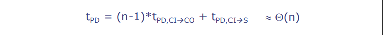

# L08-Design Tradeoffs in Arithmetic Circuits

---

MIT 6.004 2019 L08 Design Tradeoffs in Arithmetic Circuits，由教授Arvind讲述。

这次讲座的主题为：算术电路中的设计权衡。

## 主要内容

1. **组合逻辑讲座**：
- 这是关于组合逻辑的最后一讲，之后的课程将转向时序逻辑学习，这也是一个非常有趣的话题。
- 本周四将有一次测验，已经安排了复习课程。

2. **算术电路中的设计折衷**：
- 硬件设计中算法的折衷是一个非常有趣的话题。设计算术电路可以说是没有穷尽的，理论家和实践者都在这个领域工作。
- 需要进行多维优化，我们希望最小化电路占用面积，同时也希望最小化延迟（即输入到输出的时间），而功率消耗则稍后在课程中讨论。
- 在选择算法时需要有高层次的理解，因为在硬件中对算法的折衷与在软件中不同。例如，有些算法可能在某些情况下效果非常好，因为我们需要更好的硬件。

3. **算法在硬件设计中的应用**：
- 你需要能够用一种高级描述语言表达你的算法，然后输入到编译器中生成代码。工具可以做很多优化，有时候会出现意外的结果。
- 理论上我们需要了解为什么某个算法比另一个更好，但实践中我们也需要看到这是否真的如此。

4. **快速加法器的设计**：
- 我们将讨论一个快速加法器的设计，这并不是一个虚构的问题。当我们设计时序电路和像RISC-V这样复杂的处理器时，我们会关心运行速度，你会发现加法器往往是拖慢速度的因素。

5. **重温Ripple-Carry Adder**：
- Ripple-Carry Adder在设计中很容易实现。如果试图理解它的延迟，最糟糕的情况是进位信号需要从最不重要的位一直传递到最重要的位。
- 我们使用Big O表示法（如O(n)）来表示电路的延迟与操作数的数量成正比。

6. **Carry-Lookahead Adders（CLA）**：
- CLA的关键想法是将携带的链转换为树，这种转换是为了加速进位信号的生成。
- 在CLA中，我们使用generate和propagate概念，这些不依赖于进位信号的值，这给我们一个机会来组成这些进位信号。
- 最终，我们可以在对数时间内（如log n）生成所有进位信号。

7. **加法器性能和面积**：
- 讲座最后，讨论了不同加法器的性能和它们占用的面积。例如，与基本的Ripple-Carry Adder相比，递归的Carry Select Adder有更快的性能，但占用的面积更大。
- Carry-Lookahead Adder在面积和性能上都表现得更好，但相比于最基本的加法器，它们的面积占用显著增加。
- 这些优化的加法器有助于提升整个机器的运行速度，因为如果不够快，整个机器可能都会变慢。

8. **综合总结**：
- 选择正确的算法对设计至关重要。如果你的算法不好，你无法弥补一个糟糕的设计。
- Carry-Lookahead Adders可以进行O(n)数量级的加法运算，尽管付出了一些面积成本。
- 这种技术可以用来优化广泛的电路类别，因此需要深入研究这些内容，它们对你的项目也将是非常有用的。

# 分页知识点

### 算法在硬件设计中的权衡
- 每个功能都允许许多实现方式，这些方式在延迟、面积和功耗方面有着广泛的权衡。
- 选择正确的**算法**对于优化设计至关重要：
  - 工具无法补偿效率低下的算法（在大多数情况下）。
  - 这就像编程软件一样。
- 案例研究：构建一个更好的加法器。

在硬件设计中，每一个电路功能都可以通过不同的实现方法来达成，而这些不同的实现方法之间存在着一系列的权衡。例如，某些设计可能在减少电路延迟（即从输入到输出所需时间）方面更加有效，但可能需要更多的硬件面积（即占用更多的芯片空间）或者更高的功耗。相对的，其他设计可能使用更少的空间或消耗更少的能量，但在处理信号时会更慢。

关键在于选择正确的算法，这是优化硬件设计的关键步骤。正如软件开发中算法的选择对程序性能有着决定性影响一样，硬件电路设计也需要以高效的方式组织逻辑和计算过程。硬件描述语言和综合工具可以帮助设计师从高层次的电路描述中生成优化的硬件实现，但它们不能完全替代一个本身就高效的算法。如果算法设计得不好，即便是使用最先进的综合工具，也无法达到最佳的硬件性能。

### 级联进位加法器：简单但慢

#### 最坏情况路径：

**从LSB到MSB的进位传播，例如，将 11...111 加到 00...001 时**

- \\( t_{PD} = (n-1) * t_{PD,C\rightarrow CO} + t_{PD,CI\rightarrow S} \approx \Theta(n) \\)
- Q(n) 读作 "n阶(order n)"，告诉我们加法器的延迟与操作数的位数成线性增长关系

级联进位加法器是一种基本的数字加法器设计，它将两个n位的二进制数进行相加。在这个设计中，每一个位的进位输出（CO）都是下一个位的进位输入（CI）。由于这种设计，最坏的延迟情况发生在进位必须通过所有位传播时，例如，从最低有效位（LSB）到最高有效位（MSB）。在这种情况下，整个加法操作的时间取决于每个全加器的进位延迟时间（\\( t_{PD,C\rightarrow CO} \\)），乘以位数减一（因为最后一位没有下一位），再加上最后一位的和输出延迟时间（\\( t_{PD,CI\rightarrow S} \\)）。

这里的公式 \\( t_{PD} \\) 表示整个加法器的传播延迟时间，大致与操作数的位数（n）成线性关系，即随着位数的增加，延迟时间线性增长。这是由大写希腊字母 Θ（Theta）所表示的，通常用来描述算法的时间复杂度。在这里，Θ(n)意味着延迟时间和操作数的位数成正比。

从硬件设计的角度来看，级联进位加法器因其简单和直观的设计而受到青睐，尤其是在位数不多的情况下。然而，在设计需要处理大量位数的高速计算硬件时，其性能可能会成为瓶颈。因此，工程师和设计师可能会探求其他类型的加法器设计，比如超前进位加法器（carry-lookahead adder），以提高性能和减少计算延迟。

### 渐近分析

#### 假设某些计算需要执行 \( n^2+2n+3 \) 步骤
- 我们说它需要 \\( \Theta \\) (\\( n^2 \\))（读作“n平方阶”）步骤
- 为什么？因为 \\( 2n^2 \\) 总是大于 \\( n^2+2n+3 \\)，除了几个小整数（1，2 和 3）

正式地说，\\( g(n) = \Theta(f(n)) \\) 当且仅当存在 \\( C_2 > C_1 > 0 \\)，对于除了有限多个整数 \\( n \geq 0 \\) 外，都有 \\( C_2 \cdot f(n) \geq g(n) \geq C_1 \cdot f(n) \\)

- \\( g(n) = O(f(n)) \\) 
- \\( \Theta \\) (…)表示两个不等式都成立；
- \\( O \\) (…)只表示第一个不等式成立。

#### 解释及补充内容
在计算机科学中，渐近分析是评估算法运行效率的重要工具。它不是测量算法的实际运行时间，而是分析算法性能如何随着输入大小的增加而变化。

例如，对于一个算法，如果计算步骤的总数是输入大小 \\( n \\) 的二次函数，即 \\( n^2+2n+3 \\)，我们可以用大写的 Theta（\\( \Theta \\) ）来表示它的渐近运行时间。在这种情况下，我们关注 \\( n^2 \\) 项，因为它在 \\( n \\) 较大时主导总步骤数。当 \\( n \\) 足够大时，\\( 2n \\) 和常数 3 相比于 \\( n^2 \\) 变得不重要。

在这里，\\( g(n) = \Theta(f(n)) \\) 表示 \\( g(n) \\) 的增长速率和 \\( f(n) \\) 一致。实际上，这意味着存在常数 \\( C_1 \\) 和 \\( C_2 \\)，使得 \\( g(n) \\) 始终在 \\( C_1 \cdot f(n) \\) 和 \\( C_2 \cdot f(n) \\) 之间。对于大多数 \\( n \\) 的值，\\( g(n) \\) 不会低于 \\( C_1 \cdot f(n) \\)，也不会超过 \\( C_2 \cdot f(n) \\)。

大 O（ \\( O \\)）符号用于表示上界，即 \\( g(n) = O(f(n)) \\) 表示 \\( g(n) \\) 的增长速率不会超过 \\( f(n) \\) 的增长速率的某个常数倍。这通常用于最坏情况分析。

#### 举个例子：

在渐近分析中，假设我们有一个函数 \\( f(n) = n^2 + 2n + 3 \\) 来表示算法或硬件电路的性能，如时间复杂度或所需步骤数。我们说这个函数是 \\( O(n^2) \\) 的阶，即 "order \\( n^2 \\)"。这里的 \\( O \\) 是大O符号，用于描述最坏情况的上界。

为什么是这样的？因为当 \\( n \\) 足够大时，\\( n^2 \\) 项是支配项，也就是说它对结果的影响最大。实际上，存在两个常数 \\( C_1 \\) 和 \\( C_2 \\) （其中 \\( C_2 > C_1 > 0 \\)），使得对于所有足够大的 \\( n \\)，我们有：

\\[ C_1 \cdot n^2 \leq n^2 + 2n + 3 \leq C_2 \cdot n^2 \\]

这里的 \\( g(n) = n^2 + 2n + 3 \\)，\\( f(n) = n^2 \\)。

例如，可以取 \\( C_1 = 1 \\) 和 \\( C_2 = 4 \\)。这样，对于所有足够大的 \\( n \\)，不等式保持为真：

\\[ n^2 \leq n^2 + 2n + 3 \leq 4n^2 \\]

这两个不等式分别保证了 \\( g(n) \\) 的下界和上界。在大 \\( n \\) 的值时，2n 和 3 相对于 \\( n^2 \\) 来说不太重要，所以我们通常关注 \\( n^2 \\) 项。

要注意的是，\\( C_1 \\) 和 \\( C_2 \\) 的确切值并不重要，重要的是存在这样的常数使得这些不等式成立。实际中，你可能不会计算这些常数，而是知道对于大的 \\( n \\)，主要的增长趋势是由 \\( n^2 \\) 决定的。

大O符号 \\( O(...) \\) 只保证了上界，即 \\( g(n) \\) 不会增长得比 \\( f(n) \\) 快得多。而渐近紧确界 \\( \Theta(...) \\) 同时保证了上界和下界，说明 \\( g(n) \\) 的增长率被 \\( f(n) \\) 紧密包围。在这个例子中，因为 \\( g(n) \\) 实际上就是由 \\( n^2 \\) 的项主导，所以我们也可以说 \\( g(n) \\) 是 \\( \Theta(n^2) \\)。

#### 举个不一样的例子：

- 如果 \\( g(n) = 100n^2 \\)，那么它既是 \\( O(n^2) \\) 也是 \\( \Theta(n^2) \\)。
- 如果 \\( g(n) = n^2 + 10n \\)，那么它也是 \\( O(n^2) \\) 和 \\( \Theta(n^2) \\)，因为 \\( n^2 \\) 项仍然是支配项。
- 如果 \\( g(n) = n \log n \\)，那么它是 \\( O(n^2) \\)（因为 \\( n \log n \\) 的增长速度比 \\( n^2 \\) 慢），但它不是 \\( \Theta(n^2) \\)，因为没有任何常数 \\( C_1 \\) 使得 \\( C_1 \cdot n^2 \leq n \log n \\) 对于所有足够大的 \\( n \\) 都成立。在这种情况下，\\( n \log n \\) 的增长率显然低于 \\( n^2 \\)。

因此，\\( \Theta \\) 通常在我们已经了解算法或电路性能的确切特性时使用，而 \\( O \\) 更多地用于上界分析，特别是在我们只关心不超过某种特定增长率时。

这些概念对于硬件设计同样重要，因为它们可以帮助设计者理解和预测硬件组件在处理更大规模数据时的表现。在硬件中，我们可能关心的“步骤”可能是信号在电路中传播的时间或逻辑门的切换次数，而不仅仅是算法中的计算步骤。渐近分析允许设计者预估电路设计在不同输入大小下的表现，以确定其可伸缩性和潜在的性能瓶颈。
